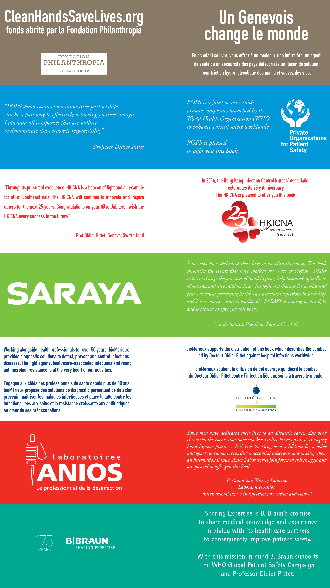

# Le geste qui sauve

[Téléchargement](geste_downloads.md)

Traductions : [us](clean-hands-save-lives.md), [de](die-rettende-geste.md), [es](un-gesto-salvador.md), [pt/br](o-gesto-que-salva.md), [pl](czyste-rece-ratuja-pl.md), [ro](mainile-curate-salveaza-vieti.md), [it](il-gesto-che-salva.md)

Vous ne le savez peut-être pas, mais une innovation a changé votre vie. En vous frictionnant les mains avec un gel hydroalcoolique, vous vous protégez des maladies.

Voici l’histoire de ce produit révolutionnaire libre de tout brevet, offert en cadeau à l’humanité par le professeur Didier Pittet et son équipe des Hôpitaux Universitaires de Genève.

Du médecin de brousse aux laboratoires pharmaceutiques, tout le monde peut désormais fabriquer cette solution permettant de sauver des millions de vies grâce à des soins plus sûrs.

Suivre l’aventure médicale de Didier Pittet, c’est découvrir qu’une autre humanité est possible avec la promesse de basculer d’une économie de prédation à une économie de paix.

« L’OMS a eu la chance que Didier Pittet réponde présent quand nous avons fait appel à lui. Bien des enseignements peuvent être tirés de son histoire superbement racontée dans ce livre. » Dr Margaret Chan, Directrice générale de l’OMS

<iframe width="560" height="315" src="https://www.youtube.com/embed/0at_jtzJCDM" frameborder="0" allowfullscreen></iframe>

### Note d’intention

J’ai écrit ce livre comme un plaidoyer pour que Didier Pittet reçoive le prix Nobel de la Paix. Il a besoin de cette reconnaissance pour généraliser sa découverte hors des hôpitaux, pour sauver encore plus de vies, pour nous épargner bien des souffrances et des larmes.

J’ai écrit ce livre parce que Didier Pittet a donné la formule du gel désinfectant, dans la pure tradition du mouvement open source en informatique. C’est un apôtre de la société du don.

J’ai écrit ce livre parce que je suis tombé sous le charme de Didier Pittet. Il y a en lui un Gandhi et une mère Teresa. Son accomplissement n’est pas tant médical que social. Plus qu’un geste de santé, il a inventé une nouvelle formule de politesse et de respect : « Je me lave les mains pour vous protéger. »

### Avec le support des laboratoires

La lutte contre les infections liées aux soins, particulièrement l’hygiène des mains, tout comme ce livre qui la raconte, bénéficient du soutien particulier de bioMérieux, B. Braun Medical, Hong Kong Infection Control Nurses’ Association, Laboratoires Anios, SARAYA et du POPS (Private Organizations for Patient Safety), une association qui a pour but de promouvoir la sécurité des patients à l’échelle globale en étroite collaboration avec l’Organisation Mondiale de la Santé et qui regroupe notamment B. Braun Medical, Deb Group (Ltd./ DebMed USA), LLC, Ecolab, Elyptol, GeneralSensing, GOJO, Hartmann Group – Bode Science Centre, Laboratoires Anios, SARAYA, Sealed Air et Surewash.

### Pourquoi une licence Creative Commons

[À la suite](http://www.framablog.org/index.php/post/2013/12/02/utopie-du-logiciel-libre-sebastien-broca) de nombreux auteurs [commonistes](/tag/commonisme), j'ai choisi la variante [Creative Commons by-nc-nd](http://creativecommons.org/licenses/by-nc-nd/4.0/deed.fr), même si ce n'est pas une licence tout à fait libre.

* Didier Pittet a donné sa formule pour faciliter l’universalisation de l’hygiène des mains. Ce livre veut participer à cette universalisation. Il doit être distribué selon les mêmes règles.

* Le texte fait l'éloge de la société du don, plus particulièrement de l'économie de paix par opposition à l'économie de prédation.

* N'importe qui peut reproduire le texte du moment qu'il en respecte la paternité (clause by) et n'en fait pas un usage commercial (clause nc). Mon éditeur ayant investi dans la finalisation de ce texte, j'estime qu'il doit être le seul à pouvoir commercialiser la version papier (j'ai gardé les droits électroniques et commercialiserai moi-même les ebooks tout en les distribuant gratuitement).

* Le texte ne peut pas être modifié parce je ne veux pas que les témoignages des personnes citées ainsi que les données scientifiques puissent être altérés sans vérification (clause nd). Je reste toutefois ouvert à toute suggestion.

* Mes droits d'auteur seront reversés au [Fond Clean Hands Save Lives](http://cleanhandssavelives.org/) abrité par la Fondation Philanthropia. Chaque fois que vous achèterez un exemplaire de ce livre, vous offrirez à un médecin, une infirmière, un agent de santé ou un secouriste des pays défavorisés un flacon de solution pour friction hydro-alcoolique des mains et sauverez des vies.

### Revue de presse

1. 16/8/2105, _DNA_, [L’opération mains propres du Dr Pittet](http://www.dna.fr/sante/2015/08/16/l-operation-mains-propres-du-dr-pittet) ([JPG](_i_/pressPittet.jpg)), Joël Carassio
2. 30/7/2014, _L’llustré_, [Didier Pittet: le Genevois qui a sauvé des millions de vies](http://www.illustre.ch/illustre/article/didier-pittet-le-genevois-qui-sauv%C3%A9-des-millions-de-vies), Laurent Favre
3. 10/7/2014, Blog, [Book Review: Clean Hands Save Lives](http://talkcleantome.blogspot.fr/2014/07/book-review-clean-hands-save-lives.html)
4. 14/6/2014, Blog, [Du brevet comme arme de guerre au don comme acte de paix](http://scinfolex.com/2014/06/14/du-brevet-comme-arme-de-guerre-au-don-comme-acte-de-paix/), Lionel Maurel
5. 11/5/2014, _Le Matin Dimanche_, [La méthode d’un Genevois a sauvé beaucoup de vies](http://www.lematin.ch/sante-environnement/sante/methode-genevois-sauve-vies/story/18643129), Stéphanie Gardier
6. 10/5/2014, _24 Minutes_, L’agent et la gloire, Didier Pittet s’en lave les mains, Thérèse Courvoisier

7. 6/5/2014, _Le Figaro_, L’incroyable aventure des flacons de solution hydroalcoolique ([PNG](_i/figaro2014.png)), Stéphanie Gardier
8. 5/5/2014, aricjournal.com, [Review of ‘Clean Hands Save Lives’, written by Thierry Crouzet](http://www.aricjournal.com/content/3/1/13), Helene Larson
9. 5/5/2014, Blog, [5 de mayo, jornada mundial de higiene de manos de la Alianza Mundial para la Seguridad del Paciente de la OMS](http://sano-y-salvo.blogspot.com.es/2014/05/5-de-mayo-jornada-mundial-de-higiene-de.html)
10. 5/5/2014, Blog, [Aujourd’hui, on s’en lave les mains!](http://blog.monolecte.fr/post/2014/05/05/aujourdhui-on-s-en-lave-les-mains), Agnès Maillaird
11. 5/5/2014, Onefm, [Une solution désinfectante pour sauver des vies](http://www.onefm.ch/portail/Actualite/Article/une-solution-desinfectante-pour-sauver-des-vies/7723.html)
12. 1/5/2014, Blog, [Clean Hands Save Lives – and now there’s a book to prove it!](http://haicontroversies.blogspot.ch/2014/05/clean-hands-save-lives-and-now-theres.html)
13. 30/4/2014, Conférence au [Club suisse de la presse](http://2013.pressclub.ch/fr/conference/le-geste-qui-sauve#video_livestream)

14. 30/4/2014, _Le Temps_, [Ce médecin genevois qui a sauvé des milliers de vie](http://www.letemps.ch/Page/Uuid/ac8f5284-cfb0-11e3-9232-9ff6878c4797/Ce_m%C3%A9decin_genevois_qui_a_sauv%C3%A9_des_milliers_de_vie), Dejan Nikolic

15. 29/4/2014, _Midi Libre_, [Un Sétois écrit la belle histoire du gel miracle qui sauve des vies](http://www.midilibre.fr/2014/04/28/l-incroyable-histoire-du-gel-miracle-qui-sauve-des-vies,854524.php), Olivier Schlama
16. 29/4/2014, Blog, [New Book, Clean Hands Save Lives, Details the Life-Saving Potential of Alcohol-Based Handrubs](http://www.gojo.com/united-states/blog/2014/april/clean%20hands%20save%20lives%20book.aspx), Jim Arbogast
17. 28/4/2014, _La Tribune de Genève_, L’apôtre de la propreté est Genevois, Sophie Davaris

18. 9/4/2014, _ActuaLitté_, [Le geste qui sauve : récit de la démocratisation du gel hydro-alcoolique](http://www.actualitte.com/librairies/le-geste-qui-sauve-recit-de-la-democratisation-du-gel-hydro-alcoolique-49397.htm), Victor De Sepausy

### Visuels

#book #y2013 #2014-5-2-23h3
