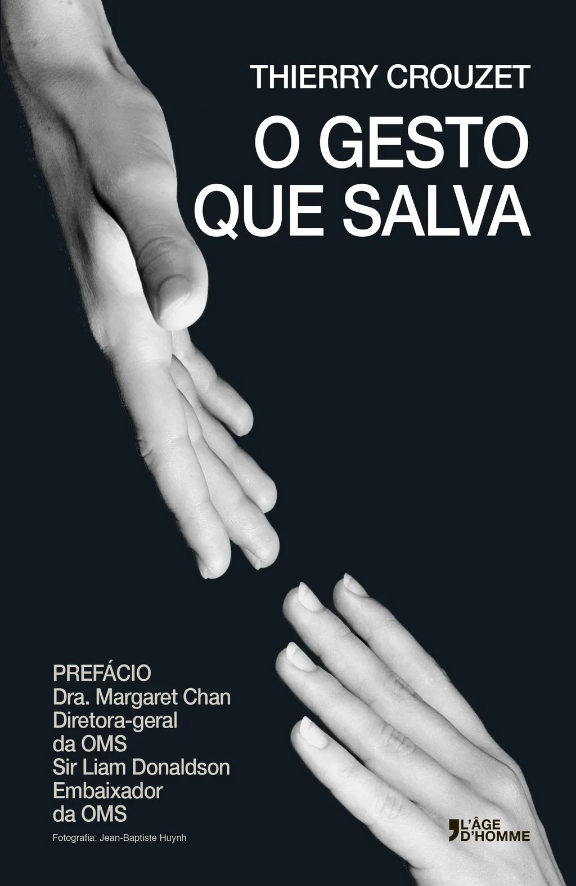

# O gesto que salva

[bookshop\_page book="pittet\_pt"]

Talvez você não tenha se dado conta, mas aconteceu uma inovação que mudou sua vida. Friccionando as mãos com um gel hidroalcoólico, você se protege das doenças. Esta é a história de um produto revolucionário que nunca foi patenteado, um presente que o professor Didier Pittet e sua equipe dos Hospitais Universitários de Genebra ofereceram à humanidade.

Hoje, tanto aquele que pratica a medicina em plena selva quanto os laboratórios farmacêuticos podem fabricar essa solução que garante mais segurança na assistência à saúde, permitindo salvar milhões de vida.

Acompanhar a aventura médica de Didier Pittet é descobrir que outra humanidade é possível, aquela que nos leva de uma economia da predação a uma economia da paz.

>"A OMS teve sorte quando Didier Pittet respondeu ao seu chamado. Numerosas são as lições que podemos tirar da história magnificamente contada neste livro." Dra. Margaret Chan, diretora-geral da OMS

Blogueiro e ensaísta, Thierry Crouzet se interessa pela convergência entre tecnologia, política, e literatura. Ex-jornalista, publicou, entre outros: Le Peuple des connecteurs (O povo dos conectadores), uma reflexão premonitória sobre a sociedade das redes; J\'ai débranché (Eu me desliguei), a historia de um burn-out numérico; La Quatrième théorie (A quarta teoria), um tecnotriller de ficção política.

Salve vidas e participe do projeto CleanHandsSaveLives.org!

#page #y2014 #2014-4-15-9h3
