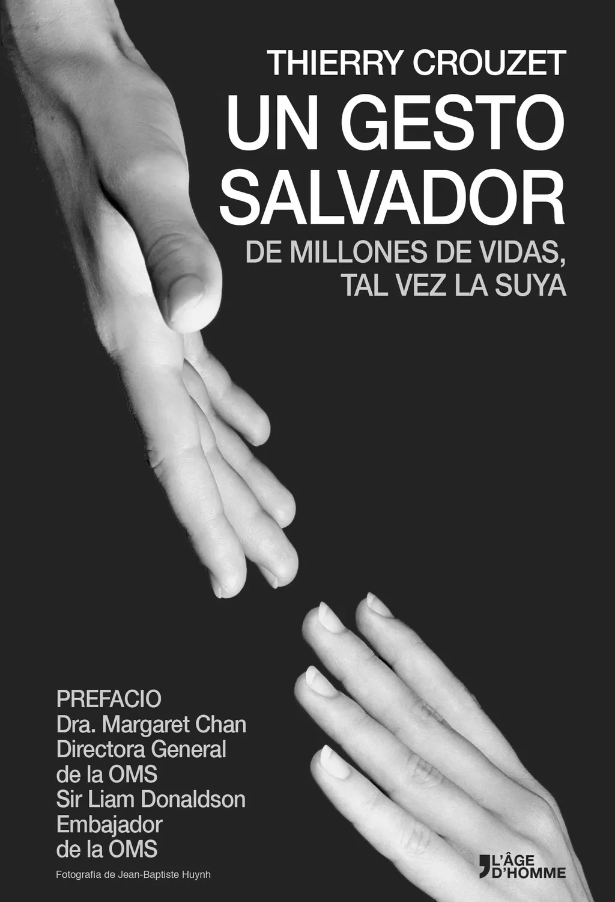

# Un Gesto Salvador

Tal vez no lo sepa, pero una innovación ha cambiado su vida. Frotándose las manos con un gel hidroalcohólico, Usted se protege de las enfermedades.

Esta es la historia de un producto revolucionario no patentado, que el profesor Didier Pittet y su equipo de los Hospitales Universitarios de Ginebra han puesto a disposición de la humanidad.

A partir de ahora, todo el mundo, desde el médico de la jungla hasta los laboratorios farmacéuticos, puede fabricar esta solución, que permite salvar vidas gracias a una atención sanitaria más segura.

A través de la aventura médica de Didier Pittet descubrimos que puede existir otra humanidad, caracterizada por el empeño en sustituir una economía de depredación por una economía de paz.

« La OMS ha tenido la suerte de que Didier Pittet responda de inmediato cuando lo necesitamos. Se podrán sacar muchas conclusiones de una historia maravillosamente bien contada en este libro. » Dra. Margaret Chan, Directora General de la OMS

Bloguero, ensayista y novelista, Thierry Crouzet es un apasionado de los temas en los que confluyen tecnología, política y literatura. Entre la publicaciones de este ex-periodista podemos destacar: *Le Peuple des connecteurs*, una reflexión premonitoria de la sociedad de la información, *J'ai débranché*, la historia de un burn-out numérico y *La Quatrième Théorie*, un thriller tecnológico de política y ficción.

<iframe width="560" height="315" src="https://www.youtube.com/embed/0at_jtzJCDM" frameborder="0" allowfullscreen></iframe>

#page #y2014 #2014-4-7-7h55
