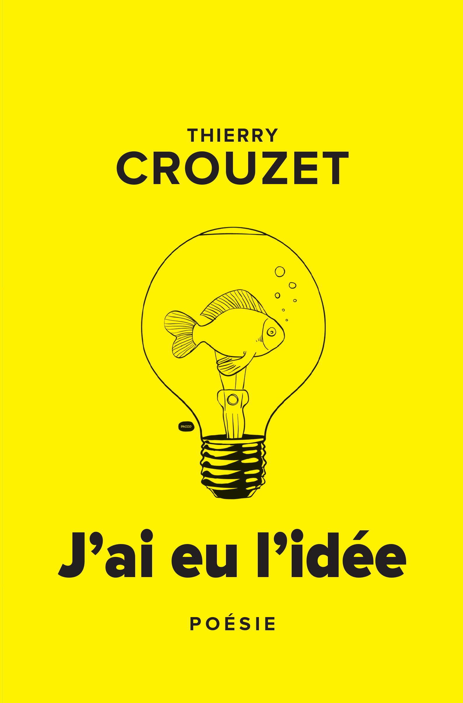

# J'ai eu l'idée

Thierry Crouzet a eu des idées, il les a collectionnées à la façon des « Je me souviens » de Perec. Comiques, politiques, philosophiques, intimistes…, elles racontent en filigrane notre époque.

« Voici des idées qu’a eues Thierry Crouzet, et probablement pas une qui puisse nous laisser indemne, même si on rit, même si – vous verrez – il s’effectue après lire d’étranges contagions… » François Bon

« Ce livre, bien que l’idée soit passée, est pourtant fait de dizaines de projections, de rêves et de fantasmes. Et c’est très jouissif. » Christophe Grossi

« Du sérieux, du pro­fond, du léger, du comique… » Henri Alberti

### Présentation

J’ai eu l’idée d’écrire *J’ai eu l’idée* en juillet 2004 dans un Boeing 747 qui m’amenait de Londres à Seattle.

J’ai tout de suite pensé à *Je me souviens* de Perec, mais surtout à toutes ces idées que j’avais eues et jamais mises en œuvre. À toute ces fois où j’ai songé dire « Je t’aime » à une femme et où je n’ai rien dit. À toutes ces autres, surtout cette autre, où je l’ai dit et où ma vie a changé.

Je n’avais pas de projet, aucune théorie sur l’écriture à contraintes, j’avais déjà beaucoup expérimenté. Je pensais simplement me libérer de ce qui aurait pu être si seulement j’avais développé une ou deux idées. J’ai écrit ce texte sans y penser au fil des années. J’ai l’impression qu’il n’est pas de moi, mais un produit de l’époque dont il raconte l’histoire en filigrane.

Je prends conscience que j’ai écrit une sorte de roman, surtout après avoir réorganisé et sélectionné les idées. C’est un voyage à travers les pensées d’un homme, à travers son temps, ses questions, ses enjeux, ses rêves. C’est donc bel et bien un roman même s’il n’en adopte pas la forme canonique. Il n’y a pas à proprement parler de personnages, quoi qu’en cherchant bien certains reviennent de manière récurrente. Il n’y pas non plus de narration, quoi que l’ordre des idées épouse une progression dramatique.

### Ils en parlent

* 19/7/2010 [Pierre Ménard](http://www.liminaire.fr/spip.php?article652)

* 19/7/2010 [Christophe Grossi](http://blog.epagine.fr/index.php/2010/07/2-auteurs-publie-net-pierre-menard-et-thierry-crouzet-portraitextraits/)

#book #y2010 #2010-4-22-9h28
