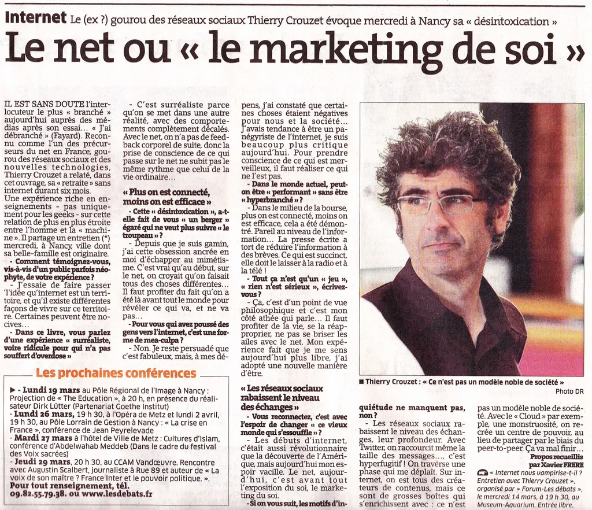
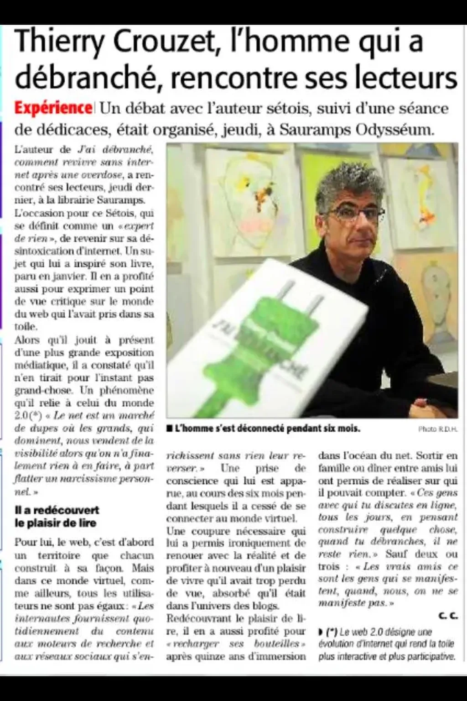
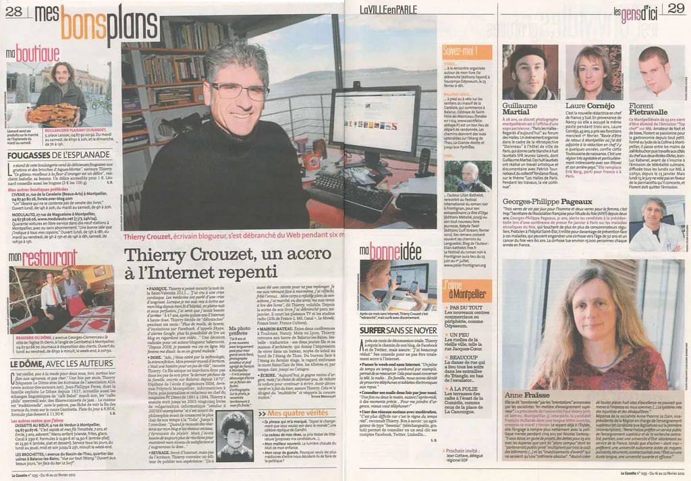

# Presse

* 29/1/2019, La Croix, [Thierry Crouzet ou le droit à la déconnexion](https://www.la-croix.com/Culture/Thierry-Crouzet-droit-deconnexion-2019-01-29-1200998786)

* 13/8/2018, Libération, [On commence à se méfier d’Internet](http://www.liberation.fr/france/2018/08/13/thierry-crouzet-auteur-on-commence-a-se-mefier-d-internet\_1672524), Christophe Alix

* 16/12/2013, La Croix, [Ils ont frôlé le «burn out numérique»](http://www.la-croix.com/Culture/Nouvelles-technologies/Ils-ont-frole-le-burn-out-numerique-2013-12-16-1076533), Paula Pinto Gomes

* 17/10/2013, France 5, La quotidienne

* Times Of India, [Digital burn-out? Tips for technology detox](http://timesofindia.indiatimes.com/tech/personal-tech/computing/Digital-burn-out-Tips-for-technology-detox/articleshow/20759688.cms)

* 29/10/2012, Le Firago, [Se recentrer pour vivre mieux](http://sante.lefigaro.fr/actualite/2012/10/30/19373-se-recentrer-pour-vivre-mieux), Pascale Senk.

* 11/9/2012, Le Parisien, [Internet, ça suffit!](http://www.leparisien.fr/loisirs-et-spectacles/internet-ca-suffit-11-09-2012-2159655.php), Hélène Bry

* 13/8/2012, psychologies.com, [Addict, il s’est déconnecté d’Internet pendant six mois](http://www.psychologies.com/Culture/Medias/Interviews/Addict-il-s-est-deconnecte-d-Internet-pendant-six-mois)

* 28/4/2012, Télé 7 jours, Et si on débranchait tout ?, Alexandre Durand

* 28/4/2012, La dépêche du Midi, [Thierry Crouzet : "Comment j’ai débranché"](http://www.ladepeche.fr/article/2012/04/28/1341216-thierry-crouzet-comment-j-ai-debranche.html)

* 6/4/2012, AFP, [Thierry Crouzet, blogueur hyperactif victime d’un "burn-out" numérique](http://fr-ca.actualites.yahoo.com/thierry-crouzet-blogueur-hyperactif-victime-dun-burn-num%C3%A9rique-085739828.html), Katia Dolmadjian

* 5/4/2012, blog, [À mots déliés](http://www.amotsdelies.com/blog/2012/04/jai-debranche/), Florence Clerfeuille

* 2/4/2012, [Eryk Mistewicz](http://erykmistewicz.pl/news/226/80/ODlaCZYlEM-SIe), polonais

* 1/4/2012, Nice-Matin et Corse-Matin, [High-Tech - Faut-il déconnecter ?](http://www.corsematin.com/article/etats-unis/high-tech-faut-il-deconnecter.621313.html), Philippe Dupuy

* 29/3/2012, Forbes.pl, [Attention Crash](http://www.forbes.pl/artykuly/sekcje/oko-na-swiat/attention-crash,25605,2), Eryk Mistewicz

* 19/3/2012, blog, [Le chemin de l’imaginaire](http://le-chemin-imaginaire.blogspot.fr/2012/03/jai-debranche-thierry-crouzet.html)

* 12/3/2012, L’est républicain, [Le gourou des réseaux sociaux évoque à Nancy sa Désintoxication](http://www.estrepublicain.fr/economie/2012/03/12/le-net-ou-le-marketing-de-soi), Xavier Frère

* 9/3/2012, France 2, JT 20h

* 28/2/2012, Psychologie.com, [Addict, il s’est déconnecté d’Internet pendant six mois](http://www.psychologies.com/Culture/Medias/Interviews/Addict-il-s-est-deconnecte-d-Internet-pendant-six-mois), Margaux Rambert

* 27/2/2012, Midi-Libre, Thierry Crouzet, l’homme qui a débranché rencontre ses lecteurs

* 24/2/2012, Éclectique, Au secours, je me suis paumée dans le réseau

* 23/2/2012, Echo Magazine, Ils ont débranché… un moment

* 23/2/2012, Science et Avenir, Le buzz du mois…, Carole Chatelain

* 23/2/2012, France 3 Languedoc Roussillon, 12h, Philippe Sans

* 22/2/2012, L’Express, Être heureux sans…, Natacha Czerwinski

* 22/2/2012, Radios Chrétiennes Francophones, On en parle

* 21/2/2012, 20 minutes, [Web, réseaux sociaux, ressentez-vous le besoin de «décrocher»?](http://www.20minutes.fr/societe/883919-web-reseaux-sociaux-ressentez-vous-besoin-decrocher), Christine Laemmel

* 19/2/2012, blog, [Décrochage ou simple pause numérique ?](http://www.maubon.info/2012/02/decrochage-ou-simple-pause-numerique), Grégory Maubon

* 16/2/2012, Slate.fr, [Thierry Crouzet, le retraité de l’Internet](http://www.slate.fr/story/49753/HIGH-TECH-thierry-crouzet-internet-retraite-addiction-debranche), Monique Dagnaud

* 15/2/2012, La Gazette de Montpellier, Thierry Crouzet, un accro à l’Internet repenti, Sylvie Brouillet

* 15/2/2012, Le Matin, [En 6 mois, je me suis sevré du web](http://www.lematin.ch/high-tech/web/En-6-mois-je-me-suis-sevre-du-web/story/18394312), Laurent Grabet

* 11/2/2012, Canal+, Le News Show, Ariane Massenet

* 10/2/2012, L’Opinion, Tout débrancher pour éviter l’overdose, Olivier Thibault

* 9/2/2012, 01net entreprise, Le jour où je me suis débranché

* 8/2/2012, L’Express, [Il faut devenir le roi d’Internet, plutôt que son sujet](http://www.lexpress.fr/actualite/societe/il-faut-devenir-le-roi-d-internet-plutot-que-son-sujet_1080462.html)

* 7/2/2012, M6, 12-45

* 7/2/2012, France 2, [Dans quelle étagère](http://programmes.france2.fr/dans-quelle-etagere/index-fr.php?page=accueil&id_article=3359)

* 7/2/2012, RTBF, 12-13

* 7/2/2012, blog, [Toujours on-line? Méfiez-vous de l’addiction...](http://www.aladom.fr/blog/toujours-on-line-mefiez-vous-de-addiction-503.html)

* 6/2/2012, Le Dauphiné et Vaucluse Matin, [Thierry Crouzet a décroché après une “overdose numérique”](http://www.ledauphine.com/france-monde/2012/02/06/thierry-crouzet-a-decroche-apres-une-overdose-numerique), Clémence Lena

* 5/2/2012, blog, [J’ai débranché de Thierry Crouzet](http://mregent.com/blog/2012/02/j-ai-debranche-de-thierry-crouzet-critique/), Martin Regent

* 5/2/2012, Midi-Libre, [Il a débranché pour éviter l’overdose](http://www.midilibre.fr/2012/02/04/internet-il-a-debranche-pour-eviter-l-overdose,453339.php), Olivier Schlama

* 4/2/2012, Fémina, Savez-vous débrancher ?

* 4/2/2012, Le Point, [Un sevré du Net retrouve le bleu du ciel](http://www.lepoint.fr/la-liste/un-sevre-du-net-retrouve-le-bleu-du-ciel-04-02-2012-1427360_312.php)

* 3/2/2012, Le Temps, [Tout débrancher, c’est grave docteur?](http://www.letemps.ch/Page/Uuid/3534146e-4e5b-11e1-bbc0-56306e65bc4e/Tout_d%C3%A9brancher_cest_grave_docteur)

* 3/2/2012, AFP, [Réseaux sociaux: tout débrancher pour éviter l’overdose](http://www.romandie.com/news/n/_TENDANCE___Reseaux_sociaux_tout_debrancher_pour_eviter_l_overdose030220121102.asp)

* 3/2/2012, blog, [Repérage week-end du 3 février 2012 : Elles, Juliette Binoche, Thierry Crouzet, William Ropp, Catherine Frot, Django Django...](http://www.mode.fr/reperage-week-end-du-3-fevrier-2012), Marie Guerre

* 2/2/2012, 01 Informatique, [Le jour où je me suis déconnecté](http://pro.01net.com/editorial/556636/temoignage-sur-laddiction-le-jour-ou-je-me-suis-deconnecte/), Xavier Biseul

* 31/1/2012, blog, [TuLisQuoi](http://www.tulisquoi.net/jai-debranche-thierry-crouzet)

* 31/1/2012, La tribune de Genève, Dévoré par la technologie, un geek raconte sa thérapie, Jean-Charles Canet

* 30/1/2012, France 24, Tech 24, Marjorie Paillon

* 30/1/2012, Le républicain lorrain, [Cyberdépendance : la bataille du sevrage](http://www.republicain-lorrain.fr/actualite/2012/01/30/la-bataille-du-sevrage), Julien Bénéteau

* 29/1/2012, France 24, [Accros au web : ils débranchent](http://www.france24.com/fr/20120128-internet-accros-web-deconnecter), Sur le Net, Natalia Gallois

* 29/1/2012, Chérie FM, Journal de 9h, Sandra Deslandes

* 27/1/2012, La Cité, Comment élaborer un art de vivre avec le Net, Samuel Dixneuf

* 27/1/2012, blog, [Thierry Crouzet ou la chronique d’un burn out numérique annoncé](http://www.elaee.com/2012/01/27/12313-thierry-crouzet-ou-la-chronique-d%E2%80%99un-burn-out-numerique-annonce), Cécile Golfier-Salles

* 27/1/2012, La Voix du Nord, [Internet: un peu, beaucoup... à la folie. comment débrancher ?](http://www.lavoixdunord.fr/journal/VDN/2012/01/27/PLUS/SOMMAIRE.phtml), Delphine D’Haenens

* 26/1/2012, [France Bleue Périgord](http://sites.radiofrance.fr/chaines/france-bleu/?tag=Perigord) avec [David Derhille](https://twitter.com/#!/DavidDerhille)

* 25/1/2012, blog, [Chroniques (rapides) d’un cyberdépendant pas vraiment repenti](http://www.cyrille-borne.com/index.php?post/2012/01/25/Chroniques-(rapides)-d-un-cyberd%C3%A9pendant-pas-vraiment-repenti), Cyrille Borne

* 25/1/2012, blog, [Instantanéité quand tu nous tiens, des résolutions pour 2012 ?](http://philippe.scoffoni.net/instantaneite-quand-tu-nous-tiens-des-resolutions-pour-2012/), Philippe Scoffoni

* 23/1/2012, blog, [Quand une hyper-connectée lit Thierry Crouzet, celui qui a osé se débrancher](http://www.ecribouille.net/2012/01/dois-je-debrancher-comme-la-fait-thierry-crouzet/)

* 23/1/2012, RTL 2, [Le grand morning](http://legrandmorning.rtl2.fr/2012/01/peut-on-vivre-sans-internet-en-2012-.html)

* 22/1/2012, blog, [Moi aussi, j’ai débranché](http://www.tetedequenelle.fr/2012/01/jai-debranche-thierry-crouzet/), Stan Jourdan

* 21/1/2012, Le Monde, [Le retour du débranché](http://www.lemonde.fr/actualite-medias/article/2012/01/23/thierry-crouzet-le-retour-du-debranche_1632794_3236.html) par Olivier Zilbertin

* 21/1/2012, France Culture, [Place de la toile](http://www.franceculture.fr/emission-place-de-la-toile-j-ai-debranche-sopa-pipa-megaupload-2012-01-21) avec Xavier de la Porte

* 20/1/2012, [Radio Grenouille Marseille](http://www.radiogrenouille.com)

* 20/1/2012, blog, [J’ai testé... Se déconnecter ? Faut oser ! : 6 mois ou 1 an sans internet, ils racontent leur expérience réelle ou imaginaire](http://sohiedelamarsa.canalblog.com/archives/2012/01/20/23228247.html) par Sophie

* 20/1/2012, France 5, [Magazine de la santé](http://www.france5.fr/sante/le-magazine-de-la-sante/emission/2012-01-20)

* 20/1/2012, Canal+, [L’édition spéciale](http://www.canalplus.fr/c-infos-documentaires/pid3847-c-la-nouvelle-edition.html)

* 20/1/2012, France Inter, Service public, [Ce qu’internet a changé dans nos vie](http://www.franceinter.fr/emission-service-public-ce-que-le-net-a-change-dans-nos-vies) avec Guillaume Erner

* 20/1/2012, blog, [Thierry Crouzet a débranché, il témoigne chez Fayard](http://jour-pour-jour.hautetfort.com/archive/2012/01/20/thierry-crouzet-a-debranche-il-temoigne-chez-fayard.html), Hervé Torchet

* 20/1/2012, Europe 1, [Le supplément magazine](http://www.europe1.fr/MediaCenter/Emissions/Bruce-Toussaint/Videos/L-addiction-a-Internet-913119/) avec Bruce Toussaint

* 19/1/2012, France Inter, [6/7](http://www.franceinter.fr/emission-le-carrefour-du-67-le-carrefour-du-67-du-19-janvier) par Hélène Chevallier

* 18/1/2012, 19-20 de Morandini sur Direct 8

* 18/1/2012, [Thierry Crouzet a vécu 6 mois sans Internet](http://www.linformaticien.com/actualites/id/23161/thierry-crouzet-a-vecu-6-mois-sans-internet.aspx), Orianne Vati

* 18/1/2012, blog, [Crouzet (nous) rebranche](http://www.tierslivre.net/spip/spip.php?article2772), François Bon

* 17/1/2012, blog, [Revivre sans internet : "J’ai débranché" de Thierry @Crouzet. Et vous ?](http://www.grebert.net/2012/01/j-ai-debranche.html), Christophe Grébert

* 17/1/2012, 20 minutes, [«Pour avoir du succès en ligne il faut jouer la provoc’, plus c’est con plus ça marche»](http://www.20minutes.fr/vousinterviewez/860578-interviewez-thierry-crouzet-livre-j-debranche)

* 17/1/2012, Cosmopolitan.fr, [Peut-on vraiment vivre sans Internet ?](http://www.cosmopolitan.fr/,peut-on-vraiment-vivre-sans-internet,2077,1582981.asp)

* 17/1/2012, RTBF, 13h30

* 17/1/2012, Le Mouv’, 12h, [Il existe une vie après internet](http://www.lemouv.fr/diffusion-il-existe-une-vie-apres-internet) avec Philippe Dana

* 16/1/2012, Europe 1, [DCDC](http://www.europe1.fr/MediaCenter/Emissions/Des-clics-et-des-claques/Sons/Des-clics-et-des-claques-16-01-12-906915/)

* 16/1/2012, Femme actuelle, Sarah Gandillot

* 16/1/2012, France Bleu Hérault, Matinale, Thierry Moity

* 14/1/2012, Europe 1, Médiapolis, Michel Field et Olivier Duhamel

* 13/1/2012, nouvelobs.com, ["J’ai décidé de me déconnecter" : des accros au web racontent](http://http://tempsreel.nouvelobs.com/societe/20120113.OBS8745/j-ai-decide-de-me-deconnecter-des-accros-au-web-racontent.html), Bérénice Rocfort-Giovanni

* 13/1/2012, blog, [Internet...attention à l’overdose!!](http://scoops.canalblog.com/archives/2012/01/13/23237864.html), Miss Julie

* 13/1/2012, [Canal+](http://player.canalplus.fr/#/573647)

* 12/1/2012, lemonde.fr, [Sans déc’ ?](http://www.lemonde.fr/idees/article/2012/01/12/sans-dec_1629020_3232.html), Marlène Duretz

* 12/1/2012, Le Nouvel Observateur, [Les prisonniers de la toile](http://tcrouzet.com/images_tc//2011/12/LE_NOUVEL_OBSERVATEUR.pdf), Bérénice Rocfort-Giovanni

* 12/1/2012, blog, [A mi-lecture du livre de Thierry Crouzet…](http://www.auxbordsdesmondes.fr/spip.php?article409), Isabelle Pariente-Butterlin

* 12/1/2012, Top Santé, [4 conseils pour bien vivre sur Internet](http://www.topsante.com/zen-attitude/bien-dans-ma-peau/4-conseils-pour-bien-vivre-sur-Internet/Conseil-n-1-on-ne-raconte-pas-sa-vie-sur-le-Web), Emilie Cailleau

* 11/1/2012, Ouest-France, [Twitter, Facebook… Six mois hors ligne après une overdose d’Internet](http://www.ouest-france.fr/actu/actuDet_-Twitter-Facebook...-Six-mois-hors-ligne-apres-une-overdose-d-Internet_39382-2031095_actu.Htm#.Tw3zlHf3S9E.twitter), Gilles Kerdreux

* 11/1/2012, France 2, JT 20h

* 11/1/2012, blog, [La vie unplugged mode d’emploi](http://sebmusset.blogspot.com/2012/01/la-vie-unplugged-mode-demploi.html), Seb Musset

* 11/1/2012, blog, [« J’ai débranché », de Thierry Crouzet, ou comment rompre avec l’animisme numérique](http://carnetsdoutreweb.blog.lemonde.fr/2012/01/11/j%E2%80%99ai-debranche-de-thierry-crouzet-ou-comment-rompre-avec-l%E2%80%99animisme-numerique/), Laurent Margantin

* 10/1/2012, Le Parisien, [Débrancher du Net fait du bien](http://www.leparisien.fr/societe/video-debrancher-du-net-fait-du-bien-10-01-2012-1805333.php), par Alexandra Echkenazi (plus [Trois conseils pour débrancher](http://www.leparisien.fr/societe/internet-trois-conseils-pour-debrancher-10-01-2012-1805351.php))

* 10/1/2012, blog, [Peut-on survivre sans internet ?](http://www.ceriseclub.com/actualites/2012/01/10/12711/peut-on-survivre-sans-internet.html)

* 20/12/2011, *Le Monde des Médias*, [Accro au Web et incapable de se connecter, l’homme moderne doit se déconnecter et méditer](http://yansored.typepad.fr/.a/6a00e008dcef0a88340162fe2cc5b1970d-pi), Quentin Moreau

* 15/12/2011, *Statégie*, [L’armée des No Names](http://www.strategies.fr/etudes-tendances/tendances/177175W/l-armee-des-no-names.html), Delphine Le Goff

* 9/12/2011, *Livre Hebdo*, Débranche !

* 6/12/2011, [Thierry Crouzet racontera ses six mois sans connexion internet dans un livre](http://www.myboox.fr/actualite/thierry-crouzet-racontera-ses-six-mois-sans-connexion-internet-dans-un-livre-10919.html)

* 2/12/2011, *Le point*, [Est-il possible de se déconnecter ?](http://www.lepoint.fr/technologie/est-il-possible-de-se-deconnecter-02-12-2011-1403145_58.php), Guillaume Grallet

* 25/11/2011, blog, [Thierry Crouzet a débranché 6 mois, j’ai testé… une petite semaine seulement](http://afondlapassion.wordpress.com/2011/11/25/thierry-crouzet-a-debranche-6-mois-jai-teste-une-petite-semaine-seulement/), Valérie Demont

#page #y2011 #2011-12-3-18h0
