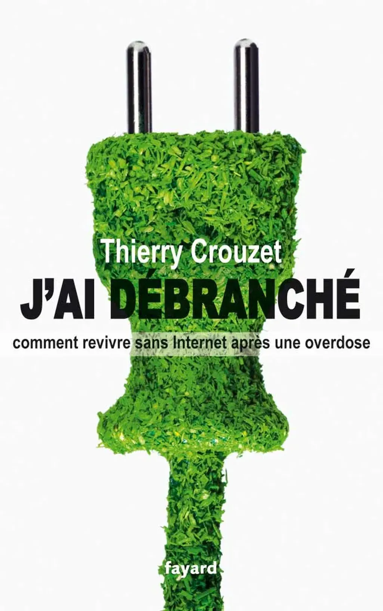

# J'ai débranché

[tcrouzet function="tcrouzet\_sousmenu" menu="unplug"]

Au début, vous regardiez vos mails une ou deux fois par jour. Combien de fois le faites-vous aujourd’hui ? Vous arrive-t-il de consulter vos messages compulsivement toutes les cinq minutes, comme si votre vie en dépendait ? Cherchez-vous parfois votre mobile avec plus de fébrilité que vos clés ? En un mot, seriez-vous accro à internet ? Cet outil inventé pour nous aider à mieux communiquer ferait-il de nous des esclaves ?

Épuisé par quinze ans d’hyperactivité en ligne, Thierry Crouzet, gourou des réseaux sociaux et auteur de nombreux ouvrages sur les nouvelles technologies, entame une cure de désintoxication. Il prévient ses milliers d’amis Facebook et Twitter qu’il les quitte durant six mois. Il disparaît du Net pour se sevrer. Au fil des jours, il nous raconte avec humour ses crises de manque, sa vie « débranchée », puis comment il se reconstruit, en quête d’un art de vitre à l’époque d’internet.

### Présentation

Ses amis disaient qu’il était addict aux réseaux sociaux. Sa femme se moquait de lui quand il prétendait travailler dans son bureau. Ses enfants ne supportaient plus de le voir jouer avec son téléphone. C’était la vie de Thierry Crouzet avant *son burn out numérique*. En février 2011, il a explosé en vol. Lui, qui depuis des années affirmait que le Net aide à changer le monde, a compris qu’il ne l’avait pas aidé à vivre heureux. Il était temps de tout reprendre à zéro. Pour sauver son couple, sa famille, se sauver, il a tout plaqué durant six mois.

Maître Eckhart a écrit « Vous croyez connaître la mer parce que vous la traversez avec un bateau, mais la mer n’est pas une surface, elle est abîme. Pour connaître la mer, faites naufrage. » C’est ce qu’a fait Thierry. Il s’est échoué sur une plage déserte dans le Midi de la France et il a pris ses distances.

Tout au long de son aventure, ses amis, ses enfants, et surtout sa femme, véritable héroïne de son livre, ne l’ont pas ménagé. Il a encaissé les coups avec humour, luttant contre le manque, puis se reconstruisant peu à peu, au cours d’un véritable périple initiatique qui l’a amené à consulter un guru de la méditation, à s’initier au yoga, à consulter un psy et à marcher, ramer, pédaler, explorant sans fin la nature. Paradoxe : ses amis numériques ont applaudi. Beaucoup ont exprimé leur désir de l’imiter.

Freiner. Ralentir sa vie. Écarter l’inutile. Nous avons peut-être tous besoin d’imiter Thierry Crouzet.

[Podacasts...](jai-debranche-podcasts.md)

[Revue de presse](jai-debranche-presse.md)

#book #y2011 #2012-1-11-13h30
