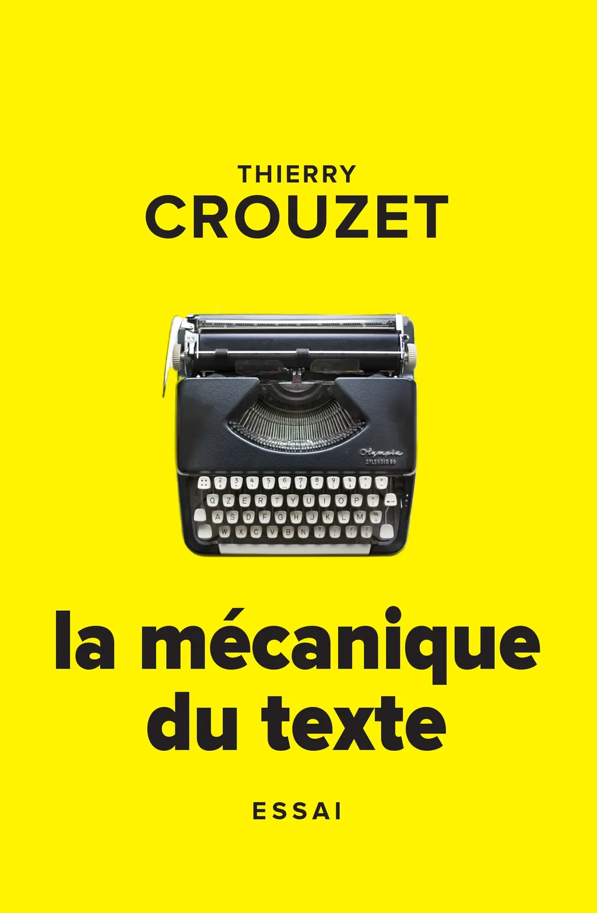
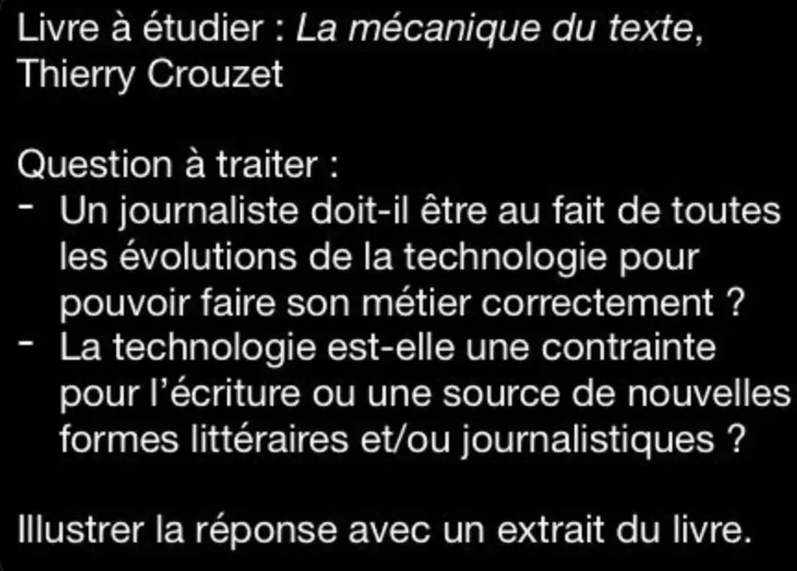

# La mécanique du texte

<iframe width="560" height="315" src="https://www.youtube.com/embed/MMwKoc8E3QI?rel=0&controls=0" frameborder="0" allowfullscreen></iframe>

Un même auteur, avec des outils différents, écrit différemment ! Thierry Crouzet défend cette thèse dans *La mécanique du texte*. Son idée de départ : la technique n'est pas plus étrangère à la littérature qu'aux arts plastiques ou à la musique. Il encourage ses collègues autant que les lecteurs, les bibliothécaires et les éditeurs à expérimenter, à changer d'outils et de logiciels. Il nous raconte comment successivement le blog, le Markdown ou Wattpad ont transformé sa vie, mais aussi comment les plumes métalliques, la machine à écrire ou le traitement de texte ont joué un rôle clé pour ses prédécesseurs du XIXe et du XXe siècle. De Flaubert à François Bon en passant par Perec, Katherine Pancol, Mark Twain ou George R.R. Martin, Crouzet lance une réflexion stimulante pour les passionnés de littérature.

### Chroniques

* [La Croix, Clémence Maret](http://www.la-croix.com/Sciences-et-ethique/Numerique/Thierry-Crouzet-Internet-incidence-lecriture-2017-08-18-1200870520)

* [Nicolas Friedli, « La mécanique du texte » de Thierry Crouzet](https://www.frdl.ch/mecanique-texte)

* [RTBF, Livré à domicile (minute 39).](https://www.rtbf.be/auvio/detail_livres-a-domicile?id=2101598)

* [Hubert Guillaud, La feuille.](http://lafeuille.blog.lemonde.fr/2015/06/29/de-linfluence-de-la-technologie-sur-la-litterature/)

* [Lorenzo Soccavo, PLE consulting.](http://ple-consulting.blogspot.fr/2015/06/sur-la-mecanique-du-texte-de-thierry.html)

* [Hervé Bienvault, Aldus 2006](http://aldus2006.typepad.fr/mon_weblog/2015/06/publienet-la-m%C3%A9canique-du-texte-de-thierry-crouzet.html).

* [Lorenzo Soccavo, Viabooks](http://www.viabooks.fr/article/pas-question-que-le-livre-disparaisse-49867).

* [Pierre Ménard, Liminaire](http://liminaire.fr/livre-lecture/article/la-mecanique-du-texte-de-thierry).

#book #y2015 #2015-5-27-17h51
