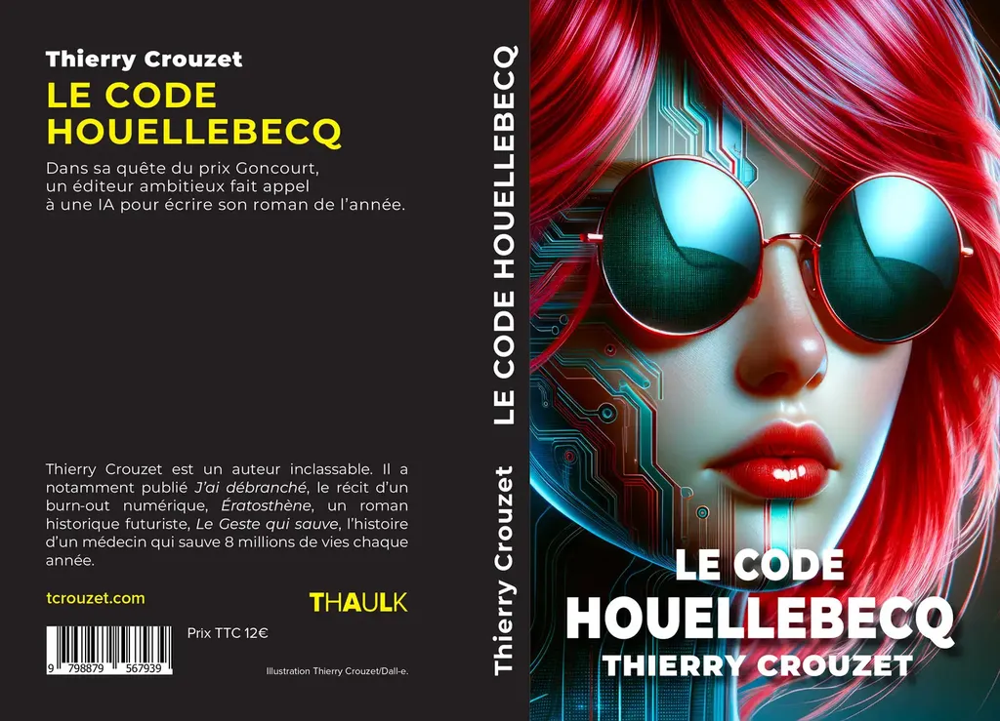

# Le Code Houellebecq

Dans sa quête du prix Goncourt, un éditeur ambitieux fait appel à une IA pour écrire son roman de l’année.

[Prélude du *Code Houellebecq*](/2024/02/14/le-code-houellebecq/)

[Prologue du *Code Houellebecq*](/2024/02/25/le-code-houellebecq-dans-le-monde-des-livres/)

#book #y2024 #2024-2-14-14h24
