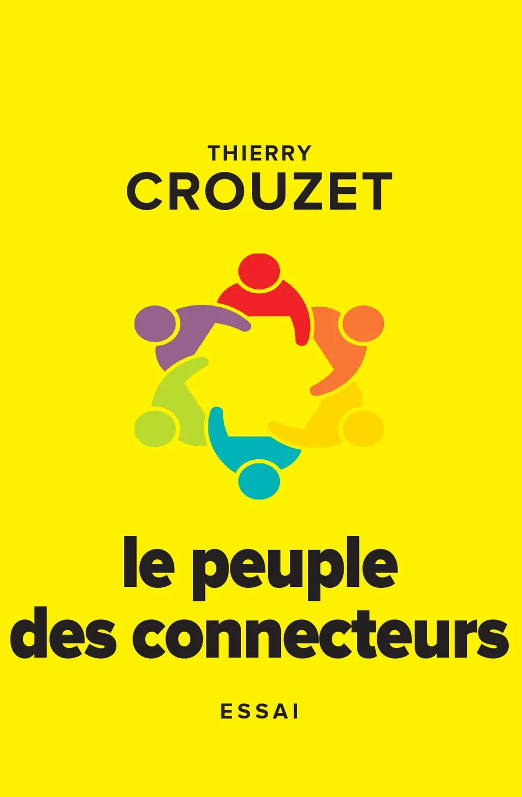

# Le peuple des connecteurs

Les connecteurs vivent dans un univers technologique entièrement nouveau par rapport aux générations qui les ont précédés. Ils appartiennent à un réseau social transnational dans lequel ils nouent sans cesse de nouveaux liens. Cette conscience du réseau transforme radicalement leur conception du monde. Sans bruit, sans manifester, sans revendiquer, ils sont en train de bouleverser tous les codes établis. De récentes découvertes scientifiques leur ont fait comprendre que notre société reposait sur des fondements inadéquats. Qu’est-ce qu’une démocratie représentative sinon une monarchie déguisée ? Qu’est-ce que le système éducatif sinon une machine à faire de nous des clones les uns des autres ? Pourquoi une autorité centralisée alors que nous pouvons nous auto-organiser ?

#book #y2006 #2006-12-21-15h15
