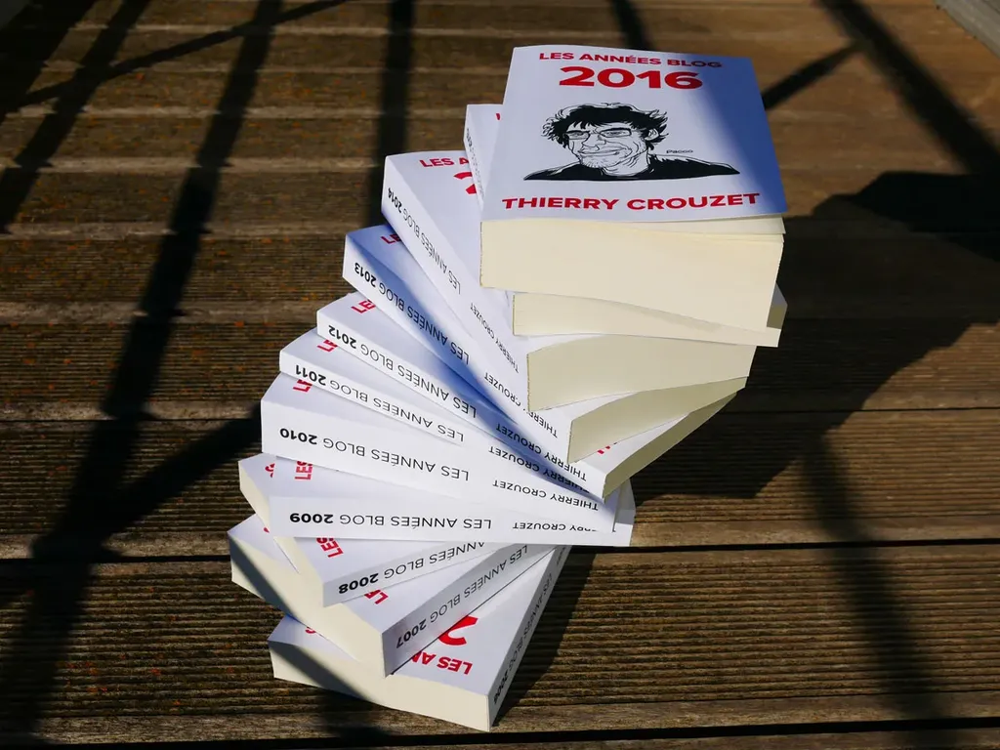

# Les années blog

À dix-sept ans, en 1980, j’ai décidé de devenir écrivain, peut-être parce que j’étais mauvais en français, surtout parce que j’avais envie de raconter des histoires. J’ai alors commencé un journal, en dilettante au début, puis avec de plus en plus d’attention à partir des années 1990.

À cette époque, mes [*Carnets de route*](/tag/carnet-de-route/) ne ressemblaient plus à un journal intime. Ils servaient de brouillons à mes autres textes. J’y éparpillais des réflexions que j’illustrais parfois d’aquarelles. À partir de la fin 2005, après avoir bouclé [*Le peuple des connecteurs*](/le-peuple-des-connecteurs/), j'ai ouvert ce carnet au public, dans ce qui est devenu mon blog. Il s’agit toujours pour moi décrire l’histoire de la pensée d’un homme, cet homme étant moi-même. Je ne veux pas bâtir un système cohérent mais avancer, quitte à me contredire sans cesse.

#book #y2011 #2011-3-27-10h46
