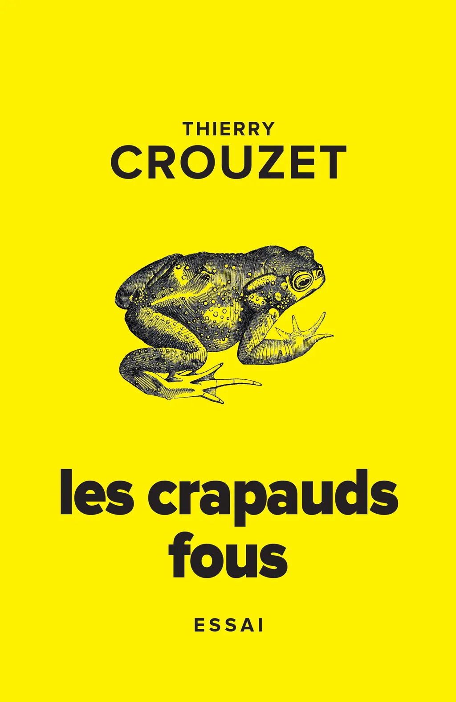
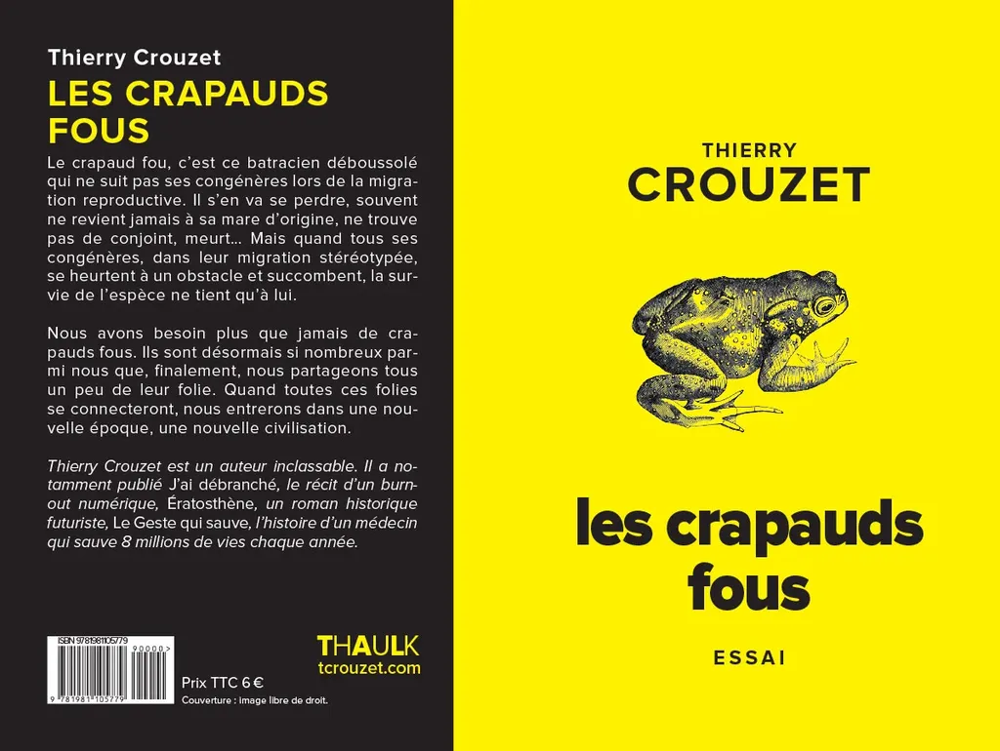

# Les crapauds fous

Le crapaud fou, c’est ce batracien déboussolé qui ne suit pas ses congénères lors de la migration reproductive. Il s’en va se perdre, souvent ne revient jamais à sa mare d’origine, ne trouve pas de conjoint, meurt… Mais quand tous ses congénères, dans leur migration stéréotypée, se heurtent à un obstacle et succombent, la survie de l’espèce ne tient qu’à lui.

Nous avons besoin plus que jamais de crapauds fous. Ils sont désormais si nombreux parmi nous que, finalement, nous partageons tous un peu de leur folie. Quand toutes ces folies se connecteront, nous entrerons dans une nouvelle époque, une nouvelle civilisation.

[Texte écrit en 2009](/tag/crapauds/), lorsque je tâtonnais avant de me lancer dans [*L'alternative nomade*](https://tcrouzet.com/alternative-nomade/).

#book #y2009 #2009-6-1-8h2
