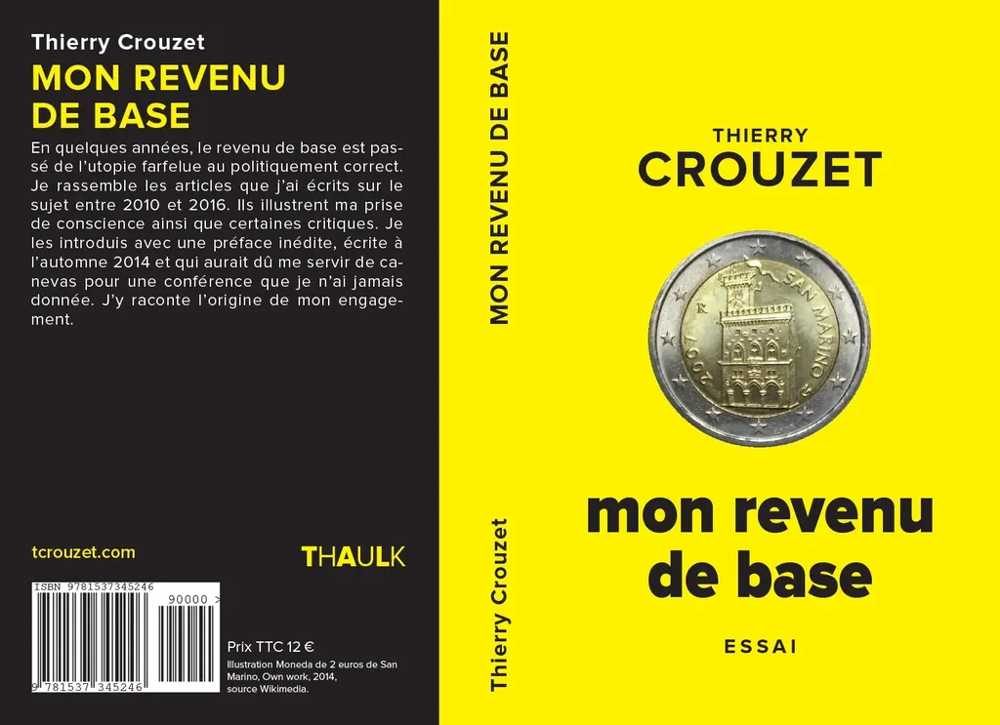

# Mon revenu de base

En quelques années, le revenu de base est passé de l’utopie farfelue au politiquement correct. Je rassemble les articles que j’ai écrits sur le sujet entre 2010 et 2016. Ils illustrent ma prise de conscience ainsi que certaines critiques. Je les introduis avec une préface inédite, écrite à l’automne 2014 et qui aurait dû me servir de canevas pour une conférence que je n’ai jamais donnée. J’y raconte l’origine de mon engagement.

#book #y2016 #2016-8-28-10h36
