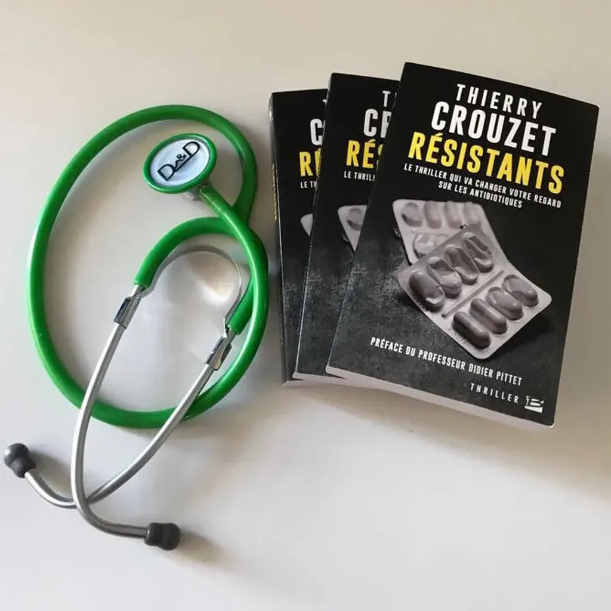

# Résistants

[Traduction anglaise](resistants-us.md)

<iframe width="560" height="315" src="https://www.youtube.com/embed/T2Pgq7vLLSo?rel=0&controls=0" frameborder="0" allowfullscreen></iframe>

Les passagers d’un yacht sont soudain terrassés par une superbactérie, résistante aux antibiotiques. Sauf Katelyn, une étudiante. Pourquoi est-elle la seule survivante ?

Recrutée par l’Anti-bioterrorism Centre, elle est chargée de retrouver l’infecteur, quitte à entrer dans son intimité. Mais l’homme qu’elle pourchasse éveille en elle des sentiments contradictoires. Il ne tue peut-être pas aveuglément… 

Une fiction 100 % scientifique !

### Avertissement

Toute ressemblance avec des médecins ou des scientifiques existants n’est ni fortuite ni involontaire : Antoine Andremont, Peter Collignon, Jennifer Gardy, Stephan Harbarth, Mzia Kutateladze, Ramanan Laxminarayan, Javier Yugueros Marcos, Denise Monack, Barbara Murray, Andreas Peschel, Andrew Read, Terry Roemer et Tim Walsh ont librement inspiré les personnages qui portent leur nom. Leurs collègues Samuel Alizon, David Bikard, Ariane Cavalier, Laurent Debardieux, Stéphane Emonet, William Griffiths, Jean-Philippe Lavigne, Patrick Linder, Didier Pittet et Julien Textoris ont quant à eux apporté leur regard critique à cette œuvre de fiction, nourrie de faits réels et garantie 100 % scientifique.

### Le projet

<iframe width="560" height="315" src="https://www.youtube.com/embed/CoRBvf-xbA0?rel=0&controls=0" frameborder="0" allowfullscreen></iframe>

« Le problème des micro-organismes résistant aux médicaments les plus puissants doit être rangé au même niveau que le terrorisme et les changements climatiques sur la liste des risques critiques pour la nation. » [Dame Sally Davies, UK Government\'s Chief Medical Officer](http://www.independent.co.uk/news/science/chief-medical-officer-dame-sally-davies-resistance-to-antibiotics-risks-health-catastrophe-to-rank-8528442.html)

« Nous ne pouvons pas attendre qu\'une bactérie hautement contagieuse et résistante à tous les antibiotiques nous frappe avant d\'agir. » [Professeur Martin Blaser](http://martinblaser.com/)

Et si le pire arrivait ?

Pour la prochaine grande crise sanitaire planétaire, on pense souvent à un virus. De nombreux films comme *Contagion*, des séries comme *Walking Dead* et [bien d’autres](http://www.allocine.fr/tags/default_gen_tag=%E9pid%E9mie+%2F+virus.html) abordent ce thème. Les épidémies de SARS, Ebola, H1N1… nous ont familiarisés avec cette possibilité.

De façon plus subreptice, un autre type de crise a déjà commencé : l’émergence de bactéries résistant aux antibiotiques. Tous les hôpitaux sont confrontés au problème. Plus nous administrons à tort et à travers des antibiotiques, plus nous favorisons l’émergence de bactéries de plus en plus difficiles à combattre. Il s’agit donc d’un problème sanitaire majeur qui pourrait tourner au cauchemar.

[D’après les études](http://www.lepoint.fr/editos-du-point/anne-jeanblanc/resistance-aux-antibiotiques-apocalypse-now-20-04-2015-1922866_57.php), d\'ici à 2050, la résistance devrait entraîner 10 millions de décès par an, soit plus que les cancers, le diabète et les accidents de la route. Dès à présent, plus de 400 000 personnes décèdent chaque année, dont près de 30 000 Européens. En France, en 2015, on dénombre 160 000 infections multirésistantes, avec 12 500 décès ([rapport de Jean Carlet](http://social-sante.gouv.fr/IMG/pdf/rapport_antibiotiques.pdf)).

Didier Pittet des [Hôpitaux Universitaires de Genève](http://www.hug-ge.ch/) m\'a demandé d\'écrire un livre pour sensibiliser le grand public à ce problème, qui ne sera réglé que par un effort de chacun de nous. J\'ai choisi la forme romanesque, parce qu\'il existe déjà quelques très bons essais sur le sujet et parce que je pense que rien ne vaut une bonne histoire pour frapper les consciences.

### Ils en parlent

* 16/08/2017, [Deuzeffe](https://www.deuzeffe.org/index.php?post/408/R%C3%A9sistants-Thierry-Crouzet)

* 25/07/2017, [Collectif Polar](https://collectifpolar.wordpress.com/2017/07/25/resistant-resistants-de-thierry-crouzet/)

* 02/07/2017, [Unwalkers](http://www.unwalkers.com/2017/07/02/resistants-thierry-crouzet-bragelonne/)

* 20/06/2017, [Hides Bouquine](http://hidesbouquine.blogspot.ch/2017/06/resistants-thierry-crouzet.html)

* 08/06/2017, RTS, [Deux nouveaux ouvrages mettent en garde contre les bactéries résistant aux antibiotiques](http://www.rts.ch/play/radio/le-journal-du-matin/audio/deux-nouveaux-ouvrages-mettent-en-garde-contre-les-bacteries-resistant-aux-antibiotiques?id=8667674), Lucia Sillig

* 06/06/2017, [Leïla Rogon](https://lalou2012.wordpress.com/2017/06/06/473/)

* 02/06/2017, [Se nourrir de livres](https://soniaboulimiquedeslivres.wordpress.com/2017/06/02/resistants-de-thierry-crouzet/)

* 01/06/2017, *Europe 1*, [Allo docteur](http://www.europe1.fr/emissions/allo-europe-1/allo-europe-1-antibiotiques-sont-ils-encore-efficaces-010517-3348173), Thomas Thouroude

<iframe width="560" height="315" src="https://www.youtube.com/embed/sC-D_u7VfPI?rel=0&controls=0" frameborder="0" allowfullscreen></iframe>

* 01/06/2017, [Avis des deux lecteurs](https://avisdesdeuxlecteurs.wordpress.com/2017/06/01/thierry-crouzet-resistants/)

* 24/05/2017, [Les pages qui tournent](https://lespagesquitournent.wordpress.com/2017/05/24/resistants-de-thierry-crouzet/)

* 22/05/2017, *FR3 Occitanie*, [9h50 le Matin](http://france3-regions.francetvinfo.fr/occitanie/emissions/9h50-occitanie) présenté par Philippe Sans

<iframe width="560" height="315" src="https://www.youtube.com/embed/ceGigJWbyRk?rel=0&controls=0" frameborder="0" allowfullscreen></iframe>

* 19/05/2017, *RTBF*, [Chronique de Michel Dufranne](https://www.rtbf.be/auvio/detail_resistants-vous-ne-regarderez-plus-votre-pharmacie-du-meme-il?id=2215437)

* 19/05/2017, *Midi-Libre*, [Un auteur sétois sur la piste des bactéries résistantes aux antibiotiques](http://www.midilibre.fr/2017/05/18/un-auteur-setois-sur-la-piste-des-bacteries-resistantes-aux-antibiotiques,1509144.php) ([PDF](/images_tc/2016/03/Midi-Libre.pdf)), Richard Boudes

* 17/05/207, radio-g.fr, [Chronique de Jean-Huges Villacamapa](http://www.radio-g.fr/content/imajn-re-16-05-2017)

<iframe width="560" height="315" src="https://www.youtube.com/embed/jM9WDUBBNYE?rel=0&controls=0" frameborder="0" allowfullscreen></iframe>

* 10/05/2017, [Fantastinet](http://www.fantastinet.com/resistants-de-thierry-crouzet/)

* 09/05/2017, [Un danger plus grand que le réchauffement climatique dans ce thriller 100% scientifique](http://eutopies.org/un-danger-plus-grand-que-le-rechauffement-climatique-dans-ce-thriller-100-scientifique/), Michèle Turbin

* 07/05/2017 [Pause Polars](http://pausepolars.canalblog.com/archives/2017/05/07/35256992.html)

* 05/05/2017 Conférence à Sauramps, Montpellier

<iframe width="560" height="315" src="https://www.youtube.com/embed/uu4pLdiYnM0?rel=0&controls=0" frameborder="0" allowfullscreen></iframe>

* 04/05/2017, RTS un, [La puce à l'oreille](https://www.rts.ch/play/tv/la-puce-a-l039oreille/video/ambiance-thriller-a-bienne---?id=8596418), émission présentée par Iris Jimenez

<iframe width="560" height="315" src="https://www.youtube.com/embed/GprBUMKPc3c?rel=0&controls=0" frameborder="0" allowfullscreen></iframe>

* 01/05/2017, [We're all mad about books](https://wereallmadaboutbooks.wordpress.com/2017/05/01/resistants-le-thriller-qui-va-changer-votre-regard-sur-les-antibiotiques/)

* 29/04/2017, *La Tribune de Genève*, [Un thriller scientifique traque la résistance aux antibiotiques](http://www.tdg.ch/geneve/actu-genevoise/thriller-scientifique-traque-resistance-antibiotiques/story/28444488), Sophie Davaris

* 28/04/2017, *The Conversation*, [« Résistants », un thriller qui vous veut du bien](http://theconversation.com/resistants-un-thriller-qui-vous-veut-du-bien-76499), Séverine Barthes

* 27/04/2017, [Black Kat](https://livrenvieblackkatsblog.wordpress.com/2017/04/27/resistants-thierry-crouzet/)

* 25/04/2017, [Et tu lis encore Emma](https://ettulisencoreemma.wordpress.com/2017/04/25/resistants-de-thierry-crouzet/)

* 24/04/2017, [Les mots de Gaiange](http://les-mots-de-gaiange.over-blog.com/2017/04/resistants.html)

* 23/02/2017, *Sud-Ouest*, [Antibiotiques : "Résistants", le thriller qui veut "frapper les consciences"](http://www.sudouest.fr/2017/03/24/antibiotiques-resistants-le-thriller-qui-veut-frapper-les-consciences-3273125-4696.php), Alexandra Tauziac

#book #y2016 #2017-4-19-13h36
