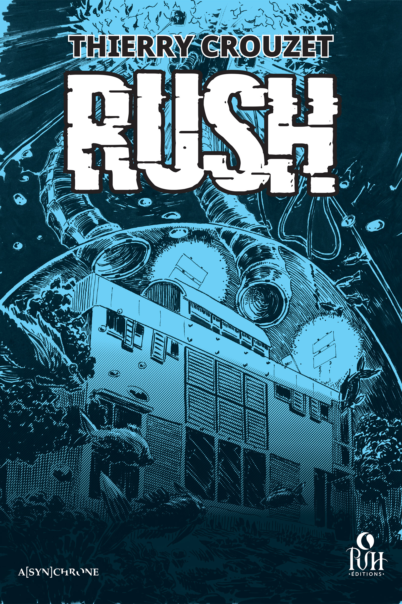
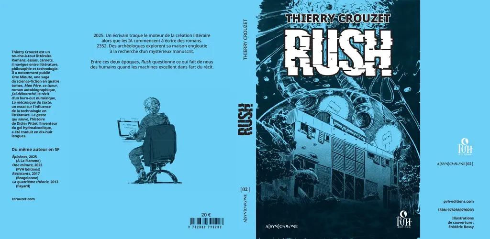

# Rush

En 2352, après la grande montée des eaux, les IA gèrent la vie des humains. Au détour d'une recherche dans les archives numériques, Roc Cardinal découvre l'image d'une femme d'avant la catastrophe, dont la beauté ensorcelante l'obsède. C'est le début d'un jeu de piste à travers les époques, dans lequel il cherche à comprendre un mode de vie révolu et l'essence même de l'acte de création.

Rush questionne ce qui fait de nous des humains quand les machines excellent dans l'art du récit.

[Mes articles](/tag/rush/)

#book #y2025 #2025-10-2-19h00
