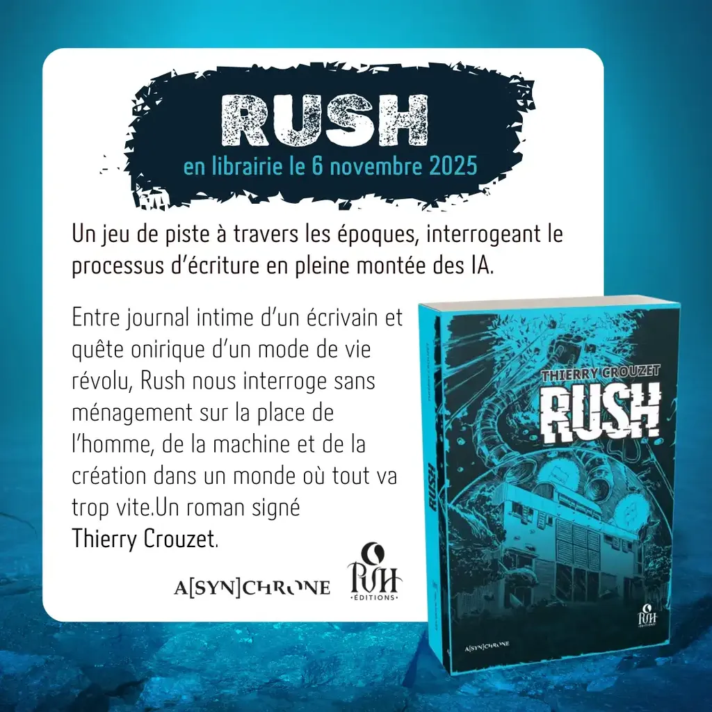

# Rush

2352, après la grande montée des eaux, une partie de l’humanité vit désormais biberonnée par les IA… Loisirs, culture, nourriture, les machines gèrent tout pour l’Homme. Au détour d’une recherche dans les archives numériques, Roc Cardinal découvre l’image d’une femme d’avant la catastrophe à la beauté ensorcelante. C’est le début d’un jeu de piste à travers les époques (2024-2025 vs 2352), pour mettre à jour fragments par fragments, *Le roman du roman*, la grande œuvre de l’écrivain Thierry Crouzet, cherchant à capter l’essence même de l’acte de création, en pleine montée des IA.

Entre journal intime d’un écrivain et quête onirique d’un mode de vie révolu, Rush nous interroge sans ménagement sur la place de l’homme, de la machine et de la création dans un monde où tout va trop vite.

<iframe width="560" height="315" src="https://www.youtube.com/embed/1ARKn3pMwCU?si=x9KBcrJzSLLxQmBV" title="YouTube video player" frameborder="0" allow="accelerometer; autoplay; clipboard-write; encrypted-media; gyroscope; picture-in-picture; web-share" referrerpolicy="strict-origin-when-cross-origin" allowfullscreen></iframe>
[Le diapoaram](https://rush-nsnqlj8.gamma.site/)

[Mes articles](/tag/rush/)

[Babelio](https://www.babelio.com/livres/Crouzet-Rush/1930193?id_edition=2492516)

#book #y2025 #2025-10-2-19h00
