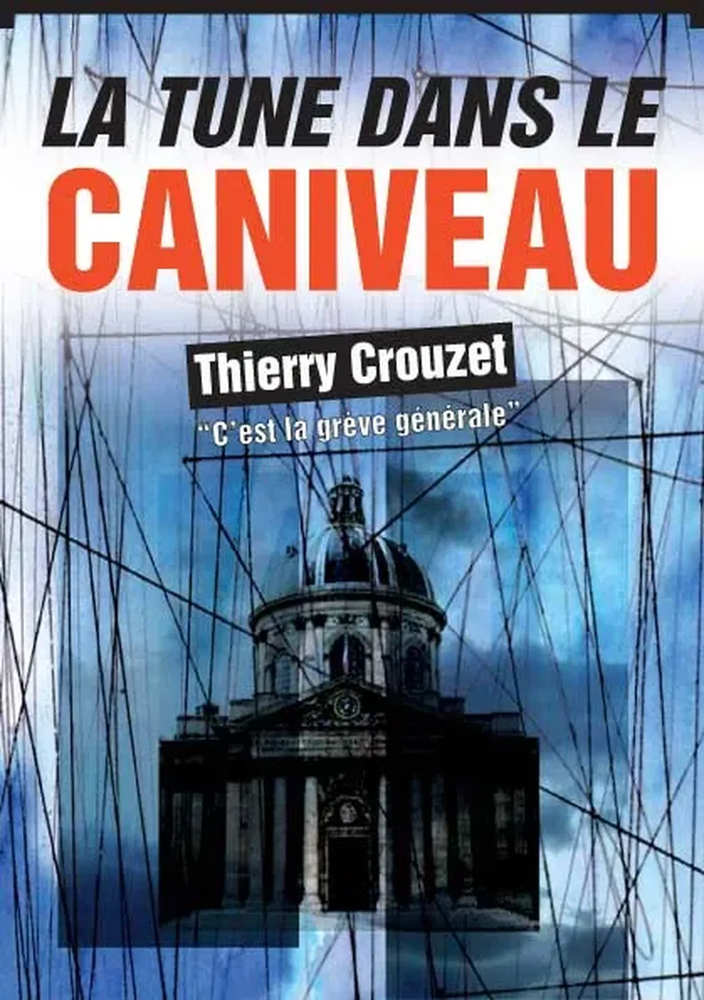
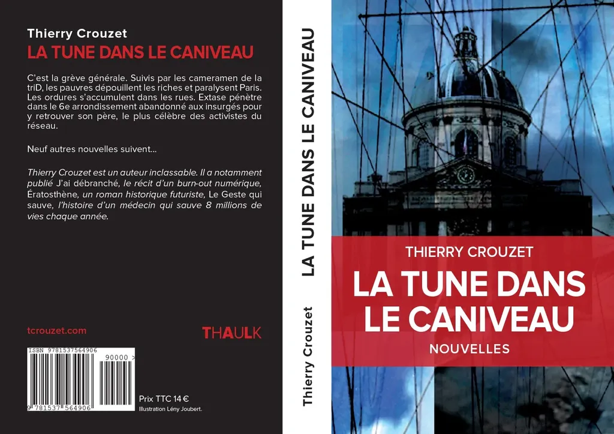
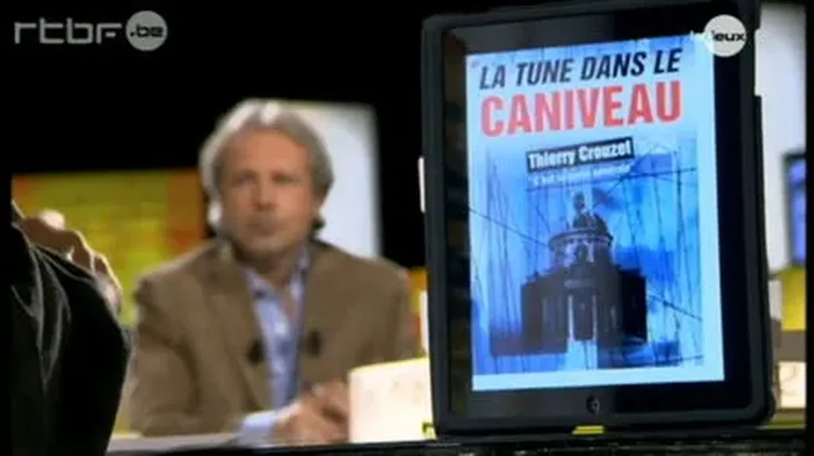

# La tune dans le caniveau

C’est la grève géné­rale. Sui­vis par les came­ra­men de la triD, les pauvres dépouillent les riches et para­lysent Paris. Les ordures s’accumulent dans les rues. Extase pénètre dans le 6e arron­dis­se­ment aban­donné aux insur­gés pour y retrou­ver son père, le plus célèbre des acti­vistes du réseau.

Suivi de nouvelles et esquisses…

* Les zombis du revenu inconditionnel, 2014 (des limites du revenu de base)

* La menace de mort, 2011 (Sous leur apparence respectable, ils manquent cruellement d’éthique)

* Le socialisme selon Starglider, 2009 (premier contact)

* Le monde de i, 2010 (L'aventure extraordinaire d'une lettre)

* La mare, 1988 (dans les rêves de Lovecraft)

* La loterie présidentielle, 1988 (du tirage au sort)

* Ménage à trois, 1990 (sitcom 1)

* Hors sujet, 1990 (sitcom 2)

* Trentenaires, 1995 (une histoire de bobos)

### Ils en parlent

[Présentation du texte chez Numériklivres...](http://numeriklivres.tumblr.com/post/1305242754/avec-la-tune-dans-le-caniveau-thierry-crouzet-a)

[Communiqué de presse de Numériklivres...](http://blog.tcrouzet.com/images_tc//2010/10/Com_Tune.pdf)

[Le Monde](http://www.blogoz.fr/2010/11/05/lexperience-inedite-de-thierry-crouzet/) (31/10/2010)

[babelio.com](http://www.babelio.com/livres/Crouzet-La-tune-dans-le-caniveau/213810)

### Dans les blogs

1. [Nessy](http://nessy.canalblog.com/archives/2010/10/18/19365975.html) (18/10/2010)

- [blog-o-book.com](http://www.blog-o-book.com/lexperience-inedite) (19/10:2010)

- [actualitte.com](http://www.actualitte.com/actualite/22216-ebook-livre-auteur-vendre-numerique.htm) (20/10/2010)

- [ebouquin.fr](http://www.ebouquin.fr/2010/10/20/edition-experience-inedite-et-cybook-orizon-a-gagner) (20/10/2010)

- [L’arbracigogne](http://larbracigogne.blogspot.com/2010/10/libraire-electronique.html) (20/10/2010)

- [tulisquoi.net](http://www.tulisquoi.net/la-tune-dans-le-caniveau-thierry-crouzet) (22/10/2010)

- [Fnacbook: lire les même bouses mais en numérique](http://tiensquelleadresseincroyablementlonguedisdonc.over-blog.com/) (22/10/2010)

- [babelio.com](http://www.babelio.com/livres/Crouzet-La-tune-dans-le-caniveau/213810) (22/10/2010)

- [lire-c-delivrant](http://lire-c-delivrant.eklablog.fr/la-tune-dans-le-caniveau-de-thierry-crouzet-a1865465) (24/10/2010)

- [Tortoise’s Times Tree](http://tortoise.servhome.org/index.php?option=com_content&view=article&id=503:la-tune-dans-le-caniveau&catid=9:readingpatch&Itemid=24) (25/10/2010)

- [Stéphane Laborde](http://www.creationmonetaire.info/2010/10/notre-generation-doit-redefinir-la.html) (25/10/2010)

- [Flo­rence Cler­feuille](http://amotsdelies.over-blog.com/article-la-tune-dans-le-caniveau-59705635.html) (29/10/2010)

- [babelio.com](http://www.babelio.com/livres/Crouzet-La-tune-dans-le-caniveau--cest-la-greve-generale/215401) (2/11/2010)

- [Pierre Lancien](http://www.l-ecritoire.net/?p=44) (3/11/2010)

- [Nicolas Ancion](http://ancion.hautetfort.com/archive/2010/11/03/48h-avec-crouzet.html) (3/11/2010)

- [Zoupic](http://www.zoupic.com/2010/11/04/thierry-crouzet-confond-le-media-et-le-message/) (4/11/2010)

- [Les lectures de Mélusine](http://la-book-melusine.over-blog.com/article-la-tune-dans-la-caniveau-de-christian-crouzet-60362456.html) (5/11/2010)

- [L’Hérétique](http://heresie.hautetfort.com/archive/2010/11/05/caniveau-parisien-post-apocalyptique.html) (6/11/2010)

- [L’Hérétique](http://heresie.hautetfort.com/archive/2010/11/08/du-centre-au-tiers-etat.html) (8/11/2010)

- [Ferocias](http://lespeuplesdusoleil.hautetfort.com/archive/2010/11/11/thierry-crouzet-la-tune-dans-le-caniveau.html) (11/11/2010)

- [Histoires de livres](http://histoires-de-livres.over-blog.com/article-la-tune-dans-le-caniveau-thierry-crouzet-60875882.html) (13/11/2010)

- [Paganiz](http://www.paganiz.com/2010/11/tune-caniveau-crouzet/) (19/11/2010)

- [RSF Blog](http://rsfblog.canalblog.com/archives/2010/11/25/19656046.html) (26/11/2010)

- [Abracadabibliothesque](http://abracadabibliothesque.wordpress.com/2010/11/27/la-tune-dans-le-caniveau-de-thierry-crouzet/) (27/11/2010)

- [A.C. de Haenne](http://a-c-de-haenne.eklablog.com/la-tune-dans-le-caniveau-de-thierry-crouzet-a2140159) (27/11/2010)

- [Le regard de Janus](http://regarddejanus.wordpress.com/2010/11/29/livre-numerique-en-chair-et-en-os/) (29/11/2010)

- [Nessy pour la V2](http://nessy.canalblog.com/archives/2010/12/01/19759056.html) (1/12/2010)

- [Stéphane Laborde](http://www.creationmonetaire.info/2010/12/la-tune-dans-le-caniveau.html) (15/12/2010)

#book #y2010 #2010-10-12-11h31
