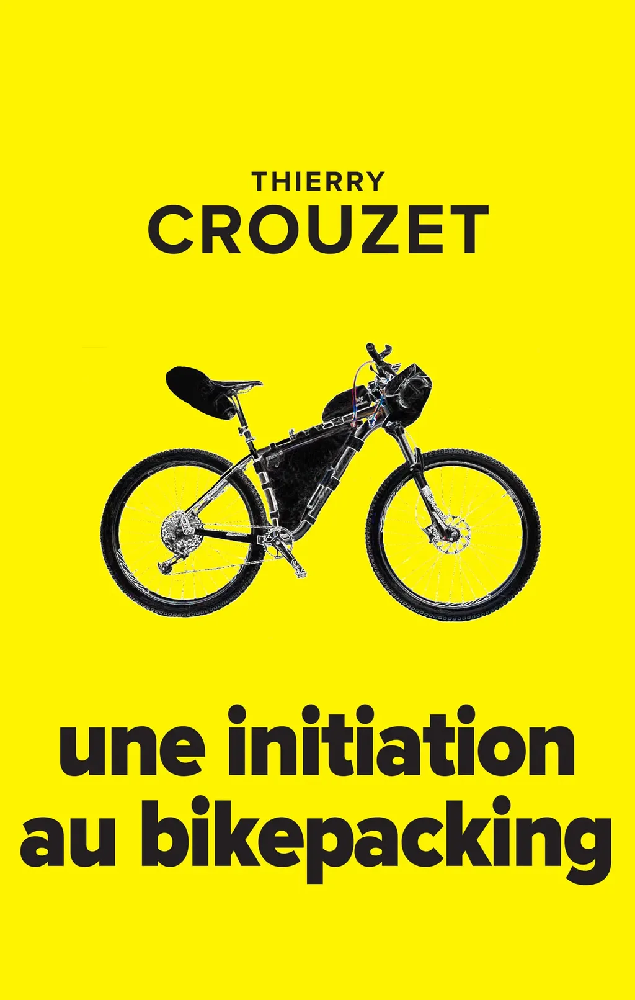

# Une initiation au bikepacking

Comment j’ai découvert le bikepacking. Comment j’ai choisi mon vélo, mon équipement. Comment j’ai vécu mes premiers voyages et comment le virus du bikepacking m’a saisi au point de me révéler un nouvel art du vélo et même un nouvel art de vivre.

[Note d'intention…](/2019/12/22/une-initiation-au-bikepacking/)

### Sommaire

1. Je constate que la Floride du Sud est ignoble pour les cyclistes. Alors je m’interroge sur l’art du vélo, sur ce que j’aime, et de fil en aiguille je découvre le bikepacking.
2. Pour me lancer, je m’engage dans l’HuRaCan 300, achète un nouveau vélo et l’équipement de bikepacking *ad hoc*.
3. Récit de mon HuRaCan.
4. Pour mieux comprendre le bikepacking, j’en établis l’histoire et rêve du vélo de bikepacking idéal.
5. Récit de ma seconde HuRaCan.
6. Je réfléchis à l’espèce de symbiose avec le territoire que nous éprouvons quand nous pédalons des journées entières avec notre matériel de camping.
7. Récit de ma Vista 300.
8. Je montre que le bikepacking apparaît avec les GPS, ce qui nous fait passer de la métaphore de la carte et du territoire à celle de la trace et du territoire.
9. Récit de ma traversée de la France Sud.
10. Je développe l’idée du vélo comme narration.

#book #y2019 #2019-12-21-12h49
