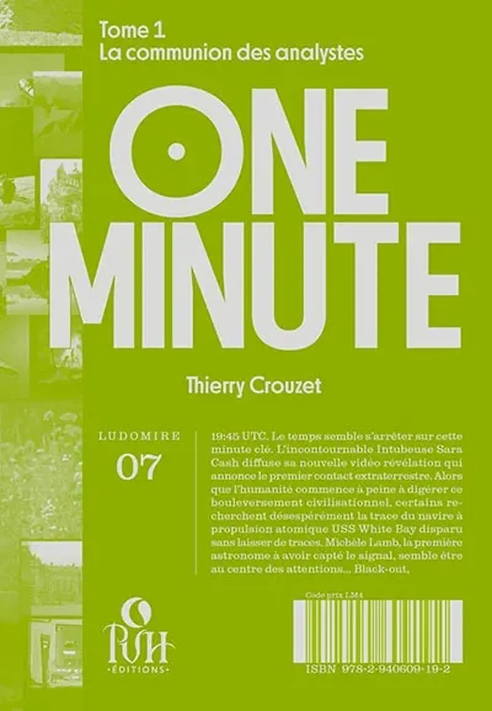
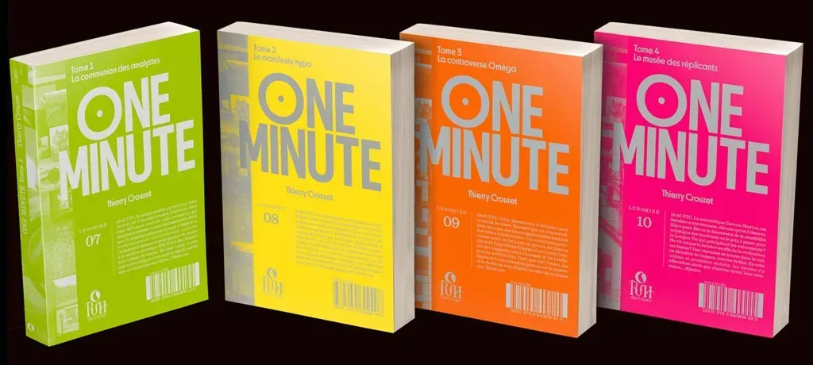
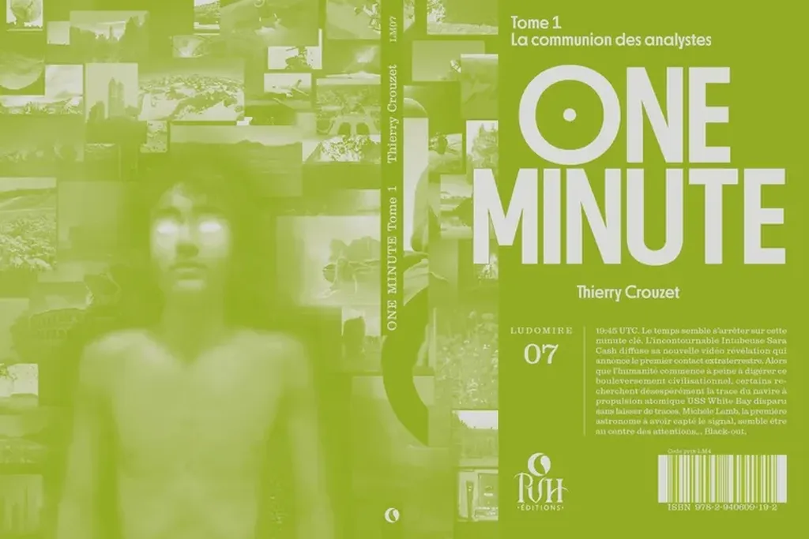
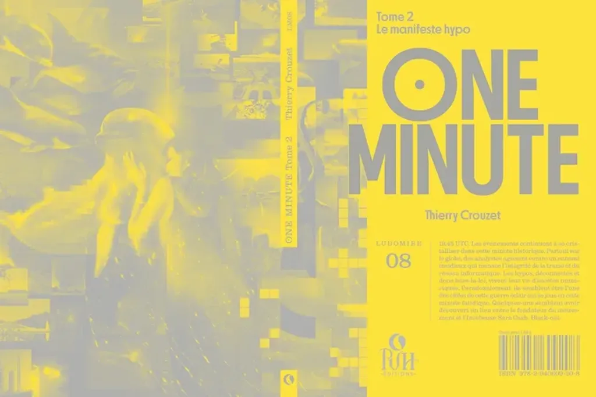
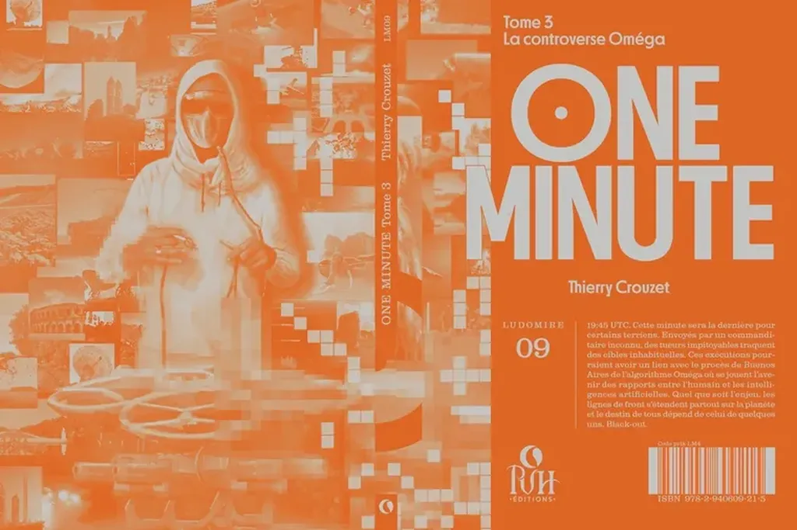

# One minute

<iframe class="iframe" width="560" height="315" src="https://www.youtube.com/embed/5w2bxFQyZ8k" title="YouTube video player" frameborder="0" allow="accelerometer; autoplay; clipboard-write; encrypted-media; gyroscope; picture-in-picture" allowfullscreen=""></iframe>

**19:45 UTC** Sara Cash annonce la réception d’un message extraterrestre. L’humanité n’est plus seule dans l’univers. Est-ce un canular ? Sara Cash ne se trompe jamais. Les gouvernements décrètent l’état d’urgence. Leur attention se focalise sur Michele Lamb, la radioastronome qui a capté le signal. Ils n’ont pas le temps d’en apprendre beaucoup. Une minute après le début du show de Sara Cash, une panne générale plonge le monde dans le blackout.

1. [*La communion des analystes*](https://pvh-editions.com/shop/romans-contes/250-one-minute-tome-1-la-communion-des-analystes-9782940609192.html)
2. [*Le manifeste hypo*](https://pvh-editions.com/shop/romans-contes/258-one-minute-tome-1-la-communion-des-analystes-9782940609192.html)
3. [*La controverse Oméga*](https://pvh-editions.com/shop/romans-contes/279-l-autre-soi-9782940609253.html)
4. [*Le musée des réplicants*](https://pvh-editions.com/shop/romans-contes/281-ne-minute-tome-4-le-musee-des-replicants-9782940609253.html)
5. [*One Minute : L’intégrale*](https://www.amazon.fr/NE-MINUTE-Lint%C3%A9grale-Thierry-Crouzet/dp/2940609233/)

Les 380 épisodes de ce feuilleton, chacun à lire en à peine plus d’une minute, racontent tour à tour cette même minute à travers de nouveaux personnages. L’histoire n’avance pas dans le temps, mais dans l’espace. De lieu en lieu, de fuseau horaire en fuseau horaire, peu à peu l’intrigue se développe et des héros émergent grâce aux regards croisés de leurs amis ou de leurs ennemis.

Ne cherchez pas de vérité, il n’y a que des points de vue.

Un jour en 2011, alors que je me sevrais du Net pour me guérir d’un burnout numérique, je me suis demandé « Que pensent les autres en ce moment ? Que fait l’humanité à l’instant même ? » C’est ainsi que j’ai eu l’idée d’écrire *One Minute* : un instantané de l’état mental de l’humanité. Restait à choisir le moment. J’en ai choisi un vers le futur, pour qu’il nous tire en avant, alors que bien des forces tentent de nous ramener en arrière.

*One Minute* est construit [comme une série TV](/2015/11/16/la-serie-une-forme-de-terrorisme-litteraire/). Le roman est tout contenu dans le premier épisode, les ultérieurs creusent la narration, décrivent avec de plus de plus de précision le monde et les personnages.

*One Minute* a été [écrit en direct sur Wattpad](https://www.wattpad.com/story/29694130) en 2015 et a recueilli plus de 230 000 lectures. En novembre 2015, le roman a été le sujet d’une [étude théorique](http://nt2.uqam.ca/fr/cahiers-virtuels/article/one-minute-de-thierry-crouzet-metamorphoses-dun-texte-dun-dispositif-lautre) par Oriane Deseilligny, chercheuse à la Sorbonne. J’ai retravaillé le roman en 2021 pour préparer son édition définitive en quatre tomes.

### Le projet 2015

Un jour, peut-être pas si lointain à la vitesse où nous découvrons des exoplanètes, nous apprendrons que nous ne sommes pas seuls dans l’univers. Alors que se passera-t-il dans les consciences à ce moment précis ?

C’est un sujet classique en SF, notamment depuis *Contact* de Carl Sagan. J’ai eu envie de l’aborder par un jeu littéraire. Décrire uniquement la minute décisive. La minute où le grand public sait. La décrire suivant une multitude de points de vue. Reprendre et reprendre cette minute en changeant d’éclairage jusqu’à ce que quelque chose émerge, une histoire, des figures, des émotions…  

Je me suis porté sur cette forme sans doute parce qu’elle se prête au feuilleton en ligne, autorise l’interaction avec les lecteurs, ouvre l’atelier et facilite d’une certaine façon la lecture non linéaire.

### Cahier des charges lors de la rédaction

1. Tout au long de 2015, publier une minute tous les jours en fin d’après-midi. C’est une forme de contrainte et de stress qui ne peut qu’avoir des conséquences sur mon style.
2. Accumuler suffisamment de minutes, idéalement 365, pour essayer de traduire l’état mental de toute l’humanité. 
3. Écrire en quasi temps réel pour pouvoir intégrer les idées, remarques et critiques des lecteurs (autrement, je ne vois pas l’intérêt d’ouvrir l’atelier, en plus j’ai peur d’assez vite manquer d’idées).
4. [À moins de se tordre le cerveau](http://lafeuille.blog.lemonde.fr/2014/03/01/optimiser-sa-vitesse-de-lecture/), un lecteur très rapide lit 2 000 signes/minute, mes minutes s’étaleront donc sur cette surface de texte, sinon il ne s’agirait plus d’une minute.
5. Une fois la minute d’un personnage écrite, il ne peut plus réapparaître que par les yeux d’autres personnages.
6. Toutes les minutes se terminent par un même blackout…

#book #y2022 #2022-5-1-10h46
