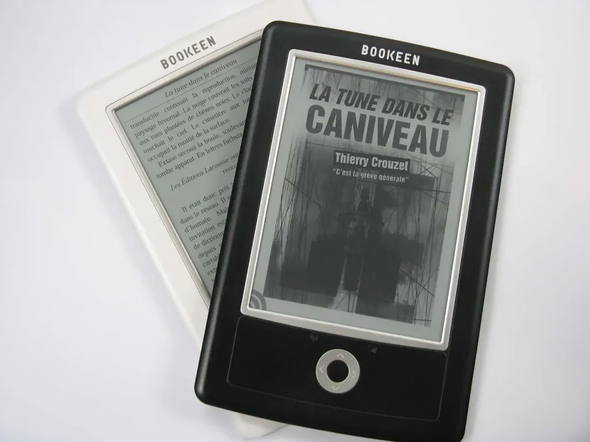

# Concours Bookeen La tune dans le caniveau

Classement des participants, l’important c’était de jouer… le concours s’est terminé le 6/12/2010.

1. [nessy.canalblog.com](http://nessy.canalblog.com/archives/2010/10/18/19365975.html) (43 visiteurs)

- [heresie.hautetfort.com](http://heresie.hautetfort.com/archive/2010/11/05/caniveau-parisien-post-apocalyptique.html) (42 visiteurs)

- [regarddejanus.wordpress.com](http://regarddejanus.wordpress.com/2010/11/29/livre-numerique-en-chair-et-en-os/) (39 visiteurs)

- [ancion.hautetfort.com](http://ancion.hautetfort.com/archive/2010/11/03/48h-avec-crouzet.html) (31 visiteurs)

- [tulisquoi.net](http://www.tulisquoi.net/la-tune-dans-le-caniveau-thierry-crouzet) (22 visiteurs)

- [rsfblog.canalblog.com](http://rsfblog.canalblog.com/archives/2010/11/25/19656046.html) (11 visiteurs)

- [la-book-melusine.over-blog.com](http://la-book-melusine.over-blog.com/article-la-tune-dans-la-caniveau-de-christian-crouzet-60362456.html) (10 visiteurs)

- [lespeuplesdusoleil.hautetfort.com](http://lespeuplesdusoleil.hautetfort.com/archive/2010/11/11/thierry-crouzet-la-tune-dans-le-caniveau.html) (visiteurs 10)

- [a-c-de-haenne.eklablog.com](http://a-c-de-haenne.eklablog.com/la-tune-dans-le-caniveau-de-thierry-crouzet-a2140159) (9 visiteurs)

- [lire-c-delivrant.eklablog.fr](http://lire-c-delivrant.eklablog.fr/la-tune-dans-le-caniveau-de-thierry-crouzet-a1865465) (9 visiteurs)

- [tiensquelleadresseincroyablementlonguedisdonc.over-blog.com](http://tiensquelleadresseincroyablementlonguedisdonc.over-blog.com/) (7 visiteurs)

- [larbracigogne.blogspot.com](http://larbracigogne.blogspot.com/2010/10/libraire-electronique.html) (5 visiteurs)

- [l-ecritoire.net](http://www.l-ecritoire.net/?p=44) (4 visiteurs)

- [abracadabibliothesque.wordpress.com](http://abracadabibliothesque.wordpress.com/2010/11/27/la-tune-dans-le-caniveau-de-thierry-crouzet/) (3 visiteurs)

- [paganiz.com](http://www.paganiz.com/2010/11/tune-caniveau-crouzet/) (3 visiteurs)

- [amotsdelies.free.fr](http://amotsdelies.over-blog.com/article-la-tune-dans-le-caniveau-59705635.html ) (2 visiteurs)

- [tortoise.servhome.org](http://tortoise.servhome.org/index.php?option=com_content&view=article&id=503:la-tune-dans-le-caniveau&catid=9:readingpatch&Itemid=24) (2 visiteurs)

- [histoires-de-livres.over-blog.com](http://histoires-de-livres.over-blog.com/article-la-tune-dans-le-caniveau-thierry-crouzet-60875882.html) (1 visiteur).

### Présentation du concours

Peu de chroniqueurs parlent des livres publiés en numérique tout simplement parce qu’ils ne sont pas équipés de liseuses. À l’occasion de la sortie de *[La tune dans le caniveau](../books/tune-caniveau.md)*, [Bookeen](http://www.bookeen.com/fr/), le pionnier français du livre électronique présent dans 70 pays, leur propose de gagner un [Cybook Orizon](http://www.bookeen.com/fr/cybook/?id=2).

Retrouvez et dialoguez avec [Bookeen](http://www.bookeen.com/fr/) sur [Facebook](www.facebook.com/bookeen) et [Twitter](http://twitter.com/BookeenTeam).

### Pour participer

1. Manifestez-vous en envoyant un mail à Isabelle Crouzet ou en laissant ici-même un commentaire. 

- Nous vous enverrons le texte intégral de *La tune dans le caniveau*. Si vous n’avez pas encore de liseuse, le texte en PDF est lisible sur votre ordinateur avec [Acrobat Reader](http://www.adobe.com/fr/products/reader/) ou en ePub avec [Calibre](http://calibre-ebook.com/).

- Chroniquez sur votre blog *[La tune dans le caniveau](../books/tune-caniveau.md)*, en bien ou en mal peu importe, pointez vers [la page de présentation de la nouvelle](../books/tune-caniveau.md) (url : http://blog.tcrouzet.com/tune-caniveau/) et illustrez le billet avec un de [nos visuels de couverture](tune-caniveau/visuels).

- N’importez pas les images chez vous. Utilisez des liens externes vers les couvertures (c’est-à-dire un code HTML du type car c’est ce qui nous permettra d’établir les statistiques pour désigner le vainqueur du concours.

- Le 07/12/2010, le gagnant sera celui dont le billet aura été le plus vu/lu. En cas d’égalité, nous tirerons au sort. Nous afficherons les résultats avec des liens vers tous les blogs participant.

- Nous éliminerons automatiquement, tous les blogs qui utiliseront des scripts pour gonfler leurs statistiques. Si vous n’êtes pas tricheur, ce point ne vous concerne pas.

### Règlement

1. La participation à ce concours implique l’acceptation des règles sans restriction.

- Le jeu concours est ouvert à toute personne animant un blog en français avec une adresse e-mail valide pour être contacté afin de recevoir sa liseuse.

- Une seule participation par blog sera prise en compte (même domaine, même adresse e-mail).

- Aucune contrepartie financière ne pourra être distribuée.

- Le lot est gracieusement mis à disposition par l’équipe Bookeen. Il ne sera ni repris, ni échangé, ni cédé. La liseuse Cybook Orizon est livrée uniquement avec les accessoires d’origine proposés par Bookeen. 

- Une fois le gagnant désigné et contacté par e-mail, il aura 3 jours pour répondre afin de se faire connaitre et accepter son lot. Sans réponse sous 3 jours, un autre gagnant sera désigné.

- Les organisateurs du concours ne peuvent pas participer au jeu.

- Les e-mails laissés pour la participation à ce jeu ne seront en aucun cas communiquées à des tiers.

- Le concours démarre le 18/10/2010 et se termine le 6/12/2010. Le gagnant sera déterminé le 7/12/2010.

#page #y2010 #2010-10-13-13h59
