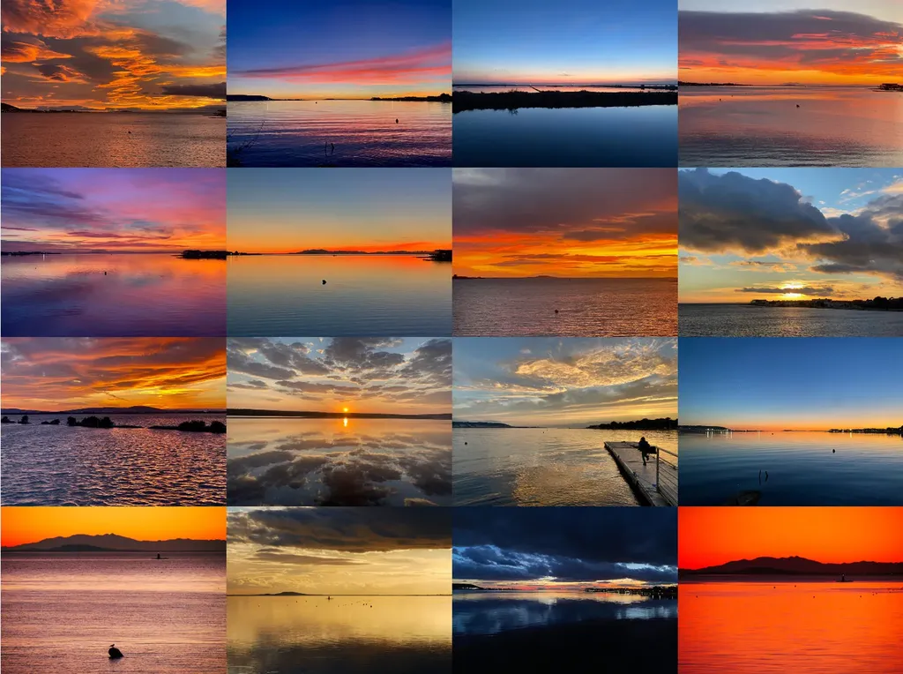

# one Sunset a Day

I am lucky enough to live on the shore of a salt lake in the South of France ([Balaruc les Bains](https://goo.gl/maps/xsAjJm6BoSe3TcXv9)). Over the last twenty years, I have taken pictures of extraordinary sunsets. Throughout 2022, I will be selling my most beautiful photos in NFT. One sunset a day.

[My collection is published on OpenSea.](https://opensea.io/assets/tcrouzet-collection?search[sortAscending]=false&search[sortBy]=CREATED_DATE&search[stringTraits][0][name]=Picture&search[stringTraits][0][values][0]=Sunset)

#page #y2022 #2022-1-3-19h36
